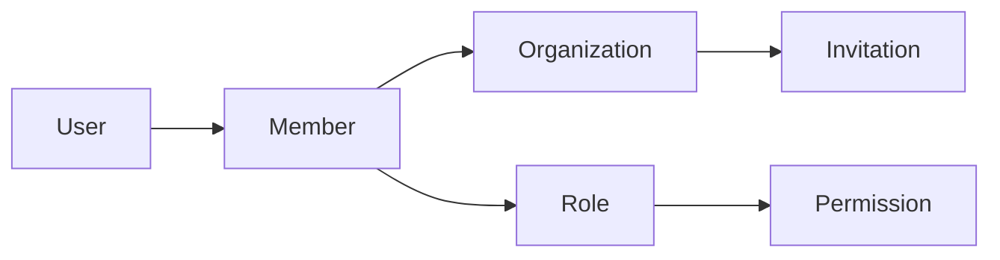
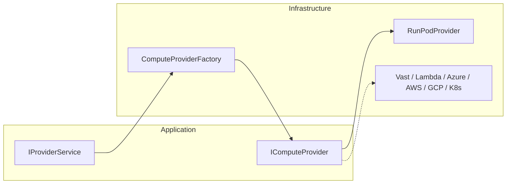
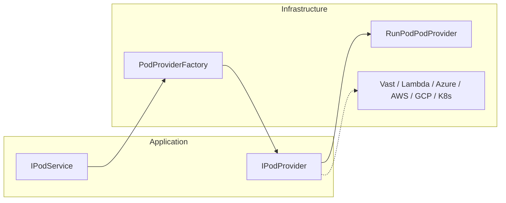
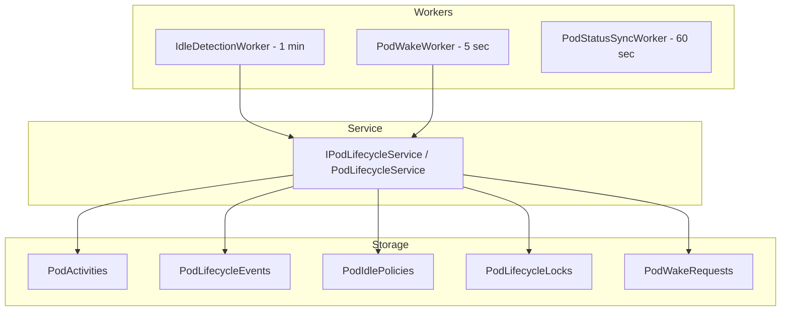
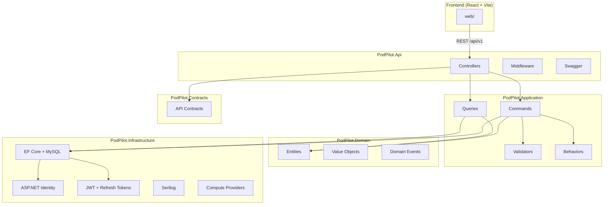
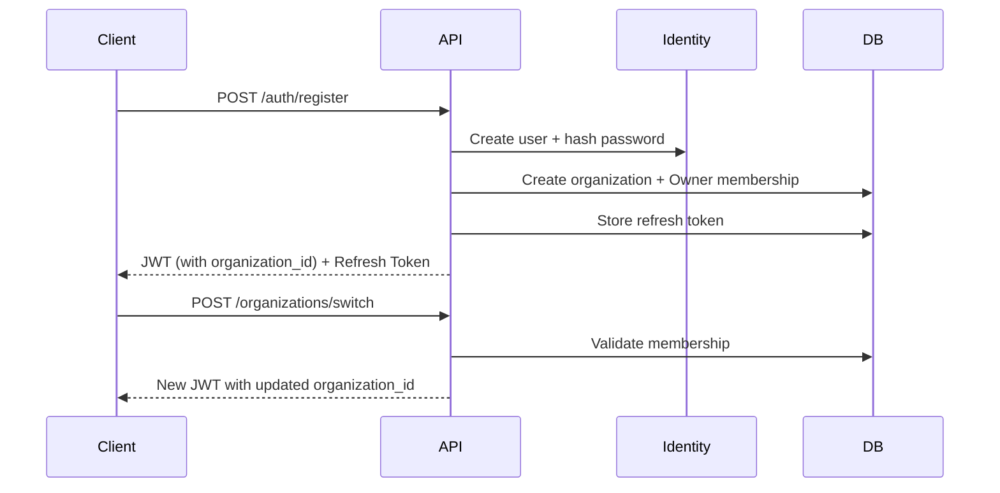
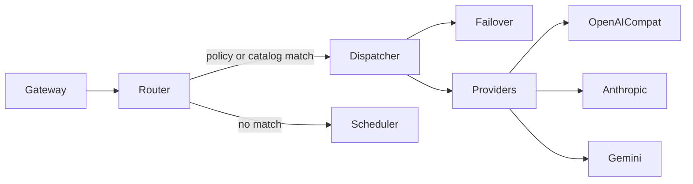
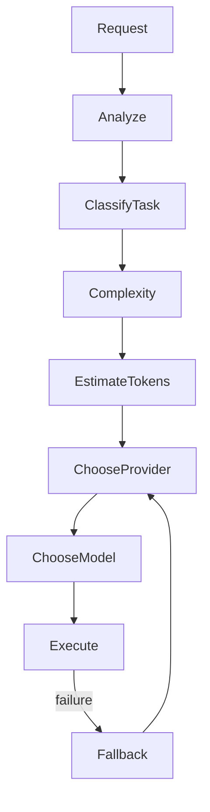

# PodPilot

**PodPilot** is an AI Infrastructure Autopilot that automatically manages GPU pods, AI models, and inference providers. This repository contains **Part 1** (authentication foundation), **Part 2** (multi-tenant organization management), **Part 3** (provider management abstraction), **Part 4** (GPU pod management), **Part 5** (automatic GPU lifecycle management), **Part 6** (AI Gateway), **Part 7** (Ollama model management), **Part 8** (smart request scheduler), **Part 9** (multi-pod orchestration and auto scaling), **Part 10** (observability, monitoring, and cost analytics), and **Part 11** (universal AI provider engine).

---

## Part 2 — Multi-Tenant Organizations

Part 2 transforms PodPilot into a **multi-tenant SaaS**. Every user belongs to one or more organizations, and all future resources (Pods, Models, Providers, Sessions) will be scoped to an organization.

### Multi-Tenant Design



- **Organization** — tenant boundary with slug, owner, and default-org flag
- **OrganizationMember** — links users to organizations with a role and status
- **Invitation** — email-based onboarding with expiring tokens
- **Permission** — granular capabilities (e.g. `Organization.Read`, `Pod.Create`)
- **Role** — Owner, Admin, Developer, Viewer with seeded permission mappings

### Current Organization Context

Users may belong to multiple organizations. The **active organization** is persisted in JWT claims:

| Claim | Description |
|-------|-------------|
| `organization_id` | Currently selected organization |
| `organization_role` | User's role in that organization |

Switching organizations calls `POST /organizations/switch`, which re-issues JWT + refresh tokens with updated claims.

### Permission System

Permissions are defined in `PermissionNames` and mapped to roles via `RolePermissionMatrix`:

| Role | Capabilities |
|------|-------------|
| **Owner** | Full control — delete org, transfer ownership, manage all resources |
| **Admin** | Manage members, invitations, and settings (cannot delete org) |
| **Developer** | Create/manage pods, providers, models (cannot manage users) |
| **Viewer** | Read-only access to organization resources |

Authorization is enforced server-side in CQRS handlers via `IOrganizationAuthorizationService`. The React frontend mirrors the same matrix for UI gating.

### Security Rules

- Only **Owner** can delete an organization
- Default organization cannot be deleted
- Only **Admin/Owner** can send invitations
- Only **Owner** can assign the Owner role (ownership transfer)
- **Developer** cannot manage users
- **Viewer** is read-only
- Cannot remove or demote the last Owner

---

## Part 3 — Provider Management

Part 3 introduces a **compute provider abstraction layer**. Organizations can connect external GPU infrastructure providers, validate credentials, inspect available regions/GPUs/templates, and monitor connection health — without coupling business logic to any single vendor API.

### Provider Abstraction



- **`IComputeProvider`** (Application interface) — vendor-neutral contract: validate credentials, list regions/GPUs/templates, account info, health checks
- **`ComputeProviderFactory`** (Infrastructure) — resolves the correct implementation by `ProviderType`
- **`RunPodProvider`** (Infrastructure) — first concrete implementation using RunPod GraphQL + REST APIs
- **Application layer never imports RunPod-specific code** — new providers are added by implementing `IComputeProvider` and registering in the factory

Supported provider types (enum): `RunPod`, `Vast`, `Lambda`, `Azure`, `AWS`, `GoogleCloud`, `Kubernetes`. Only **RunPod** is implemented in this phase; the enum and factory pattern allow future providers without changing CQRS handlers or controllers.

### Security

- API keys are encrypted at rest via ASP.NET Data Protection (`ProviderCredential`)
- API keys are **never** returned in API responses
- Key rotation is supported via `PUT /providers/{id}` with a new `apiKey`
- Validation and health checks decrypt credentials only in Infrastructure

### Background Health Monitoring

`ProviderHealthWorker` runs every **5 minutes**, checks each enabled provider, stores history in `ProviderHealthHistory`, and updates the current status on `ProviderHealth`.

### Provider Permissions

| Permission | Owner | Admin | Developer | Viewer |
|------------|-------|-------|-----------|--------|
| `Provider.Read` | ✓ | ✓ | ✓ | ✓ |
| `Provider.Create` | ✓ | ✓ | ✓ | |
| `Provider.Update` | ✓ | ✓ | ✓ | |
| `Provider.Delete` | ✓ | ✓ | | |

---

## Part 4 — GPU Pod Management

Part 4 adds full **GPU pod lifecycle management** on top of the provider abstraction. Users can create, view, start, stop, restart, delete, and sync pods — with RunPod as the first `IPodProvider` implementation.

### Pod Provider Abstraction



- **`IPodProvider`** — vendor-neutral pod lifecycle contract (create, start, stop, restart, delete, sync)
- **`RunPodPodProvider`** — RunPod REST API implementation (`https://rest.runpod.io/v1/pods`)
- **Application layer never calls RunPod directly** — handlers use `IPodService` only

### Pod Lifecycle

| Status | Description |
|--------|-------------|
| `Creating` | Pod provisioning in progress |
| `Starting` | Pod is starting |
| `Running` | Pod is active and billing |
| `Stopping` | Pod is shutting down |
| `Stopped` | Pod is stopped, volume data preserved |
| `Restarting` | Pod is restarting |
| `Deleting` | Pod termination in progress |
| `Deleted` | Pod removed (soft-deleted in DB) |
| `Failed` | Provisioning or operation failed |

### Real-Time Updates

`PodStatusHub` (SignalR at `/hubs/pods`) broadcasts `PodStatusChanged` events to organization groups whenever pod status changes — from user actions or the `PodStatusSyncWorker` (runs every 60 seconds).

### Pod Permissions

| Permission | Owner | Admin | Developer | Viewer |
|------------|-------|-------|-----------|--------|
| `Pod.Read` | ✓ | ✓ | ✓ | ✓ |
| `Pod.Create` | ✓ | ✓ | ✓ | |
| `Pod.Update` | ✓ | ✓ | ✓ | |
| `Pod.Delete` | ✓ | ✓ | ✓ | |

---

## Part 5 — Automatic GPU Lifecycle Management

Part 5 adds an intelligent **auto wake / auto shutdown engine** that tracks pod activity, detects idle GPUs, shuts down unused pods, and wakes stopped pods on demand.

### Lifecycle Engine



- **`IPodLifecycleService`** — wake, shutdown, activity tracking, idle evaluation, distributed locking
- **`IdleDetectionWorker`** — scans running pods every minute; queues shutdown when idle timeout + grace period elapse
- **`PodWakeWorker`** — processes queued wake requests; polls provider until pod is healthy
- **Database-backed locks** — `PodLifecycleLocks` prevent duplicate concurrent wake/shutdown operations

### Default Idle Policy

| Setting | Default |
|---------|---------|
| Idle timeout | 30 minutes |
| Grace period | 5 minutes |
| Minimum runtime | 10 minutes |
| Auto shutdown | Enabled |
| Auto wake | Enabled |

### SignalR Lifecycle Events

In addition to `PodStatusChanged`, the hub broadcasts: `PodStarted`, `PodStopped`, `PodSleeping`, `PodWaking`, `IdleDetected`, `WakeCompleted`, `ShutdownCompleted`, `PolicyUpdated`.

---

## Architecture

PodPilot follows **Clean Architecture** with **CQRS** (MediatR) separating concerns across layers:



### Layer Responsibilities

| Layer | Responsibility |
|-------|----------------|
| **Domain** | Business entities, enums, value objects, domain events. No framework dependencies. |
| **Application** | CQRS handlers, FluentValidation, MediatR pipeline behaviors, service interfaces. |
| **Infrastructure** | EF Core persistence, Identity, JWT, Serilog, external service implementations. |
| **Contracts** | API request/response DTOs shared between API and clients. |
| **Api** | HTTP controllers, middleware, Swagger, DI composition root. |

### Authentication Flow



---

## Folder Structure

```
PodPilot/
├── src/
│   ├── PodPilot.Api/              # ASP.NET Core Web API
│   │   ├── Controllers/V1/        # Versioned API controllers
│   │   ├── Middleware/            # Exception, logging, correlation ID
│   │   └── Dockerfile
│   ├── PodPilot.Application/      # CQRS, validators, behaviors
│   ├── PodPilot.Domain/           # Entities, enums, value objects
│   ├── PodPilot.Infrastructure/   # EF Core, Identity, JWT, Serilog
│   └── PodPilot.Contracts/        # API DTOs
├── tests/
│   ├── PodPilot.Application.Tests/
│   └── PodPilot.Api.Tests/
├── web/                           # React + TypeScript + Vite
│   ├── src/
│   │   ├── components/
│   │   ├── pages/
│   │   ├── layouts/
│   │   ├── contexts/
│   │   ├── services/
│   │   ├── hooks/
│   │   ├── types/
│   │   └── utils/
│   └── Dockerfile
├── docker-compose.yml
├── Directory.Build.props
├── .editorconfig
├── stylecop.json
└── README.md
```

---

## Prerequisites

- [.NET 10 SDK](https://dotnet.microsoft.com/download)
- [Node.js 20.19+](https://nodejs.org/) (or 22.x)
- [Docker Desktop](https://www.docker.com/products/docker-desktop/) (for containerized deployment)
- MySQL 8.x running locally on port 3306

---

## Quick Start (Docker Compose)

The recommended way to run PodPilot:

```bash
docker compose up --build
```

| Service | URL |
|---------|-----|
| **Web UI** | http://localhost:3000 |
| **API** | http://localhost:5000 |
| **Swagger** | http://localhost:5000/swagger |
| **Health** | http://localhost:5000/api/v1/health |
| **MySQL** | localhost:3306 (local instance) |

Database migrations and seeders run automatically:

1. **On every API build** (`dotnet build` on `PodPilot.Api`) — applies the latest migration via `--migrate-only`
2. **On Docker container start** — entrypoint runs migrations before the API starts
3. **On API startup** — idempotent check for any pending migrations

Applied migrations are recorded in both EF's `__EFMigrationsHistory` and the audit table `DatabaseMigrationHistory`. Each seeder run is appended to `DatabaseSeedHistory`.

To skip build-time migrations (CI without MySQL):

```bash
dotnet build -p:SkipDatabaseMigrations=true
dotnet test -p:SkipDatabaseMigrations=true
```

Manual migration only:

```bash
dotnet run --project src/PodPilot.Api -- --migrate-only
```

### Docker Services

- **api** — .NET 10 ASP.NET Core API (connects to host MySQL via `host.docker.internal`)
- **web** — React app served via nginx with API proxy

---

## Local Development

### 1. Ensure Local MySQL Is Running

Use your local MySQL instance on port **3306**. Create the database and user if needed:

```sql
CREATE DATABASE IF NOT EXISTS podpilot;
CREATE USER IF NOT EXISTS 'podpilot'@'localhost' IDENTIFIED BY 'podpilot_secret';
GRANT ALL PRIVILEGES ON podpilot.* TO 'podpilot'@'localhost';
FLUSH PRIVILEGES;
```

Update the connection string in `src/PodPilot.Api/appsettings.Development.json` if your credentials differ.

### 2. Run the API

```bash
cd src/PodPilot.Api
dotnet run
```

The API starts at http://localhost:5000 (or the port in `launchSettings.json`). Migrations apply automatically.

### 3. Run the Frontend

```bash
cd web
npm install
npm run dev
```

The frontend starts at http://localhost:5173 with API requests proxied to the backend.

---

## API Endpoints

All endpoints are versioned under `/api/v1/`:

| Method | Endpoint | Auth | Description |
|--------|----------|------|-------------|
| `POST` | `/auth/register` | No | Register user + organization |
| `POST` | `/auth/login` | No | Authenticate |
| `POST` | `/auth/refresh` | No | Rotate refresh token |
| `POST` | `/auth/logout` | Yes | Revoke refresh token |
| `GET` | `/users/me` | Yes | Current user profile |
| `GET` | `/health` | No | API + database health |

### Organizations (Part 2)

| Method | Endpoint | Description |
|--------|----------|-------------|
| `GET` | `/organizations` | List user's organizations |
| `GET` | `/organizations/{id}` | Get organization details |
| `POST` | `/organizations` | Create organization |
| `PUT` | `/organizations/{id}` | Update organization |
| `DELETE` | `/organizations/{id}` | Delete organization (Owner only) |
| `POST` | `/organizations/switch` | Switch current organization (re-issues tokens) |
| `GET` | `/organizations/{id}/members` | List members |
| `POST` | `/organizations/{id}/members` | Add existing user as member |
| `DELETE` | `/organizations/{id}/members/{memberId}` | Remove member |
| `PUT` | `/organizations/{id}/members/{memberId}/role` | Update member role |
| `POST` | `/organizations/{id}/invite` | Invite user by email |
| `POST` | `/organizations/accept` | Accept invitation by token |

### Providers (Part 3)

| Method | Endpoint | Description |
|--------|----------|-------------|
| `GET` | `/providers` | List organization providers |
| `GET` | `/providers/{id}` | Get provider details |
| `POST` | `/providers` | Create provider (validates credentials) |
| `PUT` | `/providers/{id}` | Update provider (supports API key rotation) |
| `DELETE` | `/providers/{id}` | Delete provider |
| `POST` | `/providers/validate` | Validate credentials before creation |
| `POST` | `/providers/{id}/validate` | Re-validate stored provider |
| `GET` | `/providers/{id}/regions` | List available regions |
| `GET` | `/providers/{id}/gpus` | List available GPU types |
| `GET` | `/providers/{id}/templates` | List deployment templates |
| `GET` | `/providers/{id}/health` | Current health + recent history |

### Pods (Part 4)

| Method | Endpoint | Description |
|--------|----------|-------------|
| `GET` | `/pods` | List organization pods |
| `GET` | `/pods/{id}` | Get pod details |
| `POST` | `/pods` | Create GPU pod |
| `PUT` | `/pods/{id}` | Update pod name/description |
| `DELETE` | `/pods/{id}` | Delete pod (`force` for running pods) |
| `POST` | `/pods/{id}/start` | Start pod |
| `POST` | `/pods/{id}/stop` | Stop pod |
| `POST` | `/pods/{id}/restart` | Restart pod |
| `POST` | `/pods/{id}/sync` | Sync status with provider |
| `GET` | `/pods/{id}/activity` | List pod activity history |
| `GET` | `/pods/{id}/lifecycle` | Lifecycle summary (running/idle time, next shutdown) |
| `GET` | `/pods/{id}/lifecycle/events` | Lifecycle event history |
| `POST` | `/pods/{id}/wake` | Queue wake for stopped pod |
| `POST` | `/pods/{id}/shutdown` | Shut down running pod |
| `PUT` | `/pods/{id}/idle-policy` | Update auto wake/shutdown policy |

### Example: Register

```bash
curl -X POST http://localhost:5000/api/v1/auth/register \
  -H "Content-Type: application/json" \
  -d '{
    "email": "admin@example.com",
    "password": "SecureP@ss1",
    "firstName": "Jane",
    "lastName": "Doe",
    "organizationName": "Acme AI"
  }'
```

---

## Database Schema

| Table | Description |
|-------|-------------|
| `Users` | ASP.NET Identity users (custom `ApplicationUser`) |
| `RefreshTokens` | JWT refresh tokens with rotation support |
| `Organizations` | Multi-tenant organization records |
| `OrganizationMembers` | User-organization memberships with roles |
| `Invitations` | Pending organization invitations |
| `Permissions` | Seeded permission definitions |
| `OrgRoles` | Seeded organization role catalog |
| `RolePermissions` | Role-to-permission mappings |
| `ComputeProviders` | Organization-scoped compute provider configs |
| `ProviderCredentials` | Encrypted API keys (never exposed via API) |
| `ProviderRegions` | Cached/synced region catalog per provider |
| `ProviderGpuTypes` | Cached/synced GPU catalog per provider |
| `ProviderHealthHistory` | Periodic health check history |
| `GpuPods` | Organization-scoped GPU pod records |
| `PodConfigurations` | Deployment configuration per pod |
| `PodEndpoints` | Exposed network endpoints |
| `PodStatusHistory` | Pod status change history |
| `PodActivities` | Activity records for idle detection |
| `PodLifecycleEvents` | Lifecycle engine audit events |
| `PodIdlePolicies` | Per-pod auto wake/shutdown settings |
| `PodLifecycleLocks` | Distributed operation locks |
| `PodWakeRequests` | Queued wake requests |
| `AuditLogs` | Immutable audit trail |
| `DatabaseMigrationHistory` | Audit log of applied EF migrations |
| `DatabaseSeedHistory` | Audit log of seeder executions |
| `Roles` / `UserRoles` | ASP.NET Identity role management |

### Organization Roles

- **Owner** — Full control, can delete org and transfer ownership
- **Admin** — Manage members, invitations, and settings
- **Developer** — Manage workloads, read-only on user management
- **Viewer** — Read-only access

---

## Testing

```bash
# Run all tests
dotnet test

# Application unit tests (validators + permissions)
dotnet test tests/PodPilot.Application.Tests

# API integration tests (auth + organizations + providers + pods + lifecycle)
dotnet test tests/PodPilot.Api.Tests
```

## Frontend (Part 2 + Part 3 + Part 4 + Part 5)

| Page | Route | Description |
|------|-------|-------------|
| Organizations | `/organizations` | List and manage organizations |
| Create Organization | `/organizations/create` | Create new organization |
| Settings | `/organizations/:id/settings` | Edit/delete organization |
| Members | `/members` | Member table, invite, role management |
| Accept Invitation | `/invitations/accept?token=` | Accept email invitation |
| Profile | `/profile` | User profile and memberships |
| Providers | `/providers` | List connected compute providers |
| Add Provider | `/providers/add` | Validate API key, then save |
| Edit Provider | `/providers/:id/edit` | Update provider settings / rotate key |
| Provider Details | `/providers/:id` | Regions, GPUs, templates, health status |
| GPU Pods | `/pods` | Dashboard of running/stopped pods |
| Create Pod | `/pods/create` | Configure and deploy a GPU pod |
| Pod Details | `/pods/:id` | Status, config, endpoints, history |

Key components: `OrganizationSwitcher`, `OrganizationCard`, `MemberTable`, `InvitationModal`, `RoleBadge`, `Avatar`.

---

## Configuration

### JWT Settings (`appsettings.json`)

```json
{
  "Jwt": {
    "Issuer": "PodPilot",
    "Audience": "PodPilot",
    "Secret": "your-256-bit-secret-key-here",
    "AccessTokenExpirationMinutes": 15,
    "RefreshTokenExpirationDays": 7
  }
}
```

> **Important:** Change the JWT secret in production. Docker Compose uses environment variable overrides.

### Connection String

```
Server=localhost;Port=3306;Database=podpilot;User=podpilot;Password=podpilot_secret;
```

---

### JWT Settings (`appsettings.json`)

```json
{
  "Jwt": {
    "Issuer": "PodPilot",
    "Audience": "PodPilot",
    "Secret": "your-256-bit-secret-key-here",
    "AccessTokenExpirationMinutes": 15,
    "RefreshTokenExpirationDays": 7
  }
}
```

> **Important:** Change the JWT secret in production. Docker Compose uses environment variable overrides.

### Connection String

```
Server=localhost;Port=3306;Database=podpilot;User=podpilot;Password=podpilot_secret;
```

---

## Quality Standards

- **Nullable reference types** enabled solution-wide
- **Treat warnings as errors** enforced via `Directory.Build.props`
- **StyleCop Analyzers** for code style consistency
- **XML documentation** on public APIs (Swagger integration)
- **EditorConfig** for formatting conventions

---

## Logging

Serilog is configured with:

- **Console** output with structured properties
- **Rolling file** logs in `logs/podpilot-*.log` (30-day retention)
- **Request logging** via Serilog middleware
- **Correlation ID** propagated via `X-Correlation-Id` header

---

## Part 6 — AI Gateway

Part 6 adds an OpenAI/Anthropic-compatible AI Gateway that proxies inference requests to Ollama on GPU pods.

### Architecture

```
AI IDE (OpenAI / Anthropic client)
        ↓ API key auth
   AiGatewayController (/v1/*)
        ↓
      IAiGateway
   ┌────┴────┬──────────────┬────────────────┐
   │         │              │                │
IGatewayRouter  IPodLifecycleService  IInferenceClient  IStreamingProxy
   │         │              │                │
   └────┬────┴──────────────┴────────────────┘
        ↓
   Ollama on GPU Pod
```

### Request Flow

1. Authenticate API key (`Authorization: Bearer sk-...` or `x-api-key`)
2. Resolve organization from key
3. Route request to pod via `IGatewayRouter` (model → route → pod)
4. Wake pod if stopped (`IPodLifecycleService`, source: `gateway`)
5. Poll Ollama health (`/api/tags`, `/api/version`)
6. Stream request/response via `IStreamingProxy` (transparent proxy)
7. Record `GatewayRequest`, `GatewayLatency`, and pod activity

### Supported Endpoints

| Endpoint | Compatibility |
|----------|---------------|
| `POST /v1/chat/completions` | OpenAI |
| `POST /v1/responses` | OpenAI |
| `GET /v1/models` | OpenAI / Anthropic |
| `POST /v1/messages` | Anthropic |

Management APIs (JWT): `/api/v1/gateway/*`

### API Keys

- Personal and organization-scoped keys
- SHA-256 hashed storage with prefix lookup
- Rotation and revocation
- Optional expiration
- Per-key and per-organization rate limits

### Streaming

- Server-sent events and chunked responses pass through unchanged
- Response headers applied before body streaming
- Cancellation and timeout supported

### Real-Time Dashboard

- SignalR hub: `/hubs/gateway`
- Events: `GatewayRequestStarted`, `GatewayRequestFinished`, `GatewayPodWake`, `GatewayError`
- Web UI: `/gateway`

### Example

```bash
# Create key (JWT)
curl -X POST http://localhost:5000/api/v1/gateway/api-keys \
  -H "Authorization: Bearer $JWT" \
  -H "Content-Type: application/json" \
  -d '{"name":"cursor","isPersonal":true}'

# Chat completion (API key)
curl http://localhost:5000/v1/chat/completions \
  -H "Authorization: Bearer sk-..." \
  -H "Content-Type: application/json" \
  -d '{"model":"llama3:latest","messages":[{"role":"user","content":"Hello"}]}'
```

---

## Part 7 — Ollama Model Management

Part 7 adds full **Ollama model lifecycle management** on GPU pods: detect Ollama, list/pull/delete models, track download progress, set defaults, and monitor health.

### Architecture

```
React Models UI
      ↓
/api/v1/models (JWT + RBAC)
      ↓
CQRS Handlers → IModelService
      ↓
IOllamaClient → Ollama on GPU Pod (:11434)
      ↓
AiModels / ModelDownloads / ModelHealthHistory (MySQL)
```

| Interface | Responsibility |
|-----------|----------------|
| `IOllamaClient` | Ollama HTTP API (tags, pull, show, delete, generate) |
| `IModelService` | Pod wake, pull orchestration, refresh, default model |
| `IModelRepository` | EF persistence for models/downloads/health |
| `IModelHealthService` | Generate test + health history |
| `IModelNotificationService` | SignalR download/health events |

### API Endpoints

| Method | Path | Permission |
|--------|------|------------|
| GET | `/api/v1/models` | `Model.Read` |
| GET | `/api/v1/models/dashboard` | `Model.Read` |
| GET | `/api/v1/models/{id}` | `Model.Read` |
| POST | `/api/v1/models/pull` | `Model.Pull` |
| DELETE | `/api/v1/models/{id}?forceDefault=` | `Model.Delete` |
| POST | `/api/v1/models/{id}/default` | `Model.Manage` |
| POST | `/api/v1/models/refresh` | `Model.Manage` |
| GET | `/api/v1/models/downloads` | `Model.Read` |
| GET | `/api/v1/models/health` | `Model.Read` |

### SignalR

Hub: `/hubs/models`

Events: `ModelDownloadStarted`, `ModelDownloadProgress`, `ModelDownloadCompleted`, `ModelDeleted`, `HealthUpdated`

### Background Worker

`ModelHealthWorker` runs every 5 minutes — checks Ollama reachability, model availability, and a generate test prompt. Results stored in `ModelHealthHistory`.

### Frontend

| Route | Page |
|-------|------|
| `/models` | Dashboard + installed models |
| `/models/pull` | Pull new model |
| `/models/downloads` | Active/historical downloads |
| `/models/:id` | Model metadata + health |

### Example

```bash
# Refresh models from Ollama on a pod
curl -X POST http://localhost:5000/api/v1/models/refresh \
  -H "Authorization: Bearer <jwt>" \
  -H "Content-Type: application/json" \
  -d '{"podId":"<pod-guid>"}'

# Pull a model
curl -X POST http://localhost:5000/api/v1/models/pull \
  -H "Authorization: Bearer <jwt>" \
  -H "Content-Type: application/json" \
  -d '{"podId":"<pod-guid>","model":"llama3:latest"}'
```

---

## Part 8 — Smart Request Scheduler

Part 8 adds an enterprise-grade request scheduler in front of the AI Gateway. Every inference request passes through a scheduling pipeline with priority queuing, pod load balancing, retries, and streaming support.

### Architecture

```
Incoming /v1/* request
        ↓
   IRequestScheduler (ProcessAsync)
        ↓
   Pod available? ──YES──► IRequestDispatcher (immediate)
        ↓ NO
   IRequestQueue (Redis priority queue)
        ↓
   SchedulerDispatchWorker
        ↓
   IRequestDispatcher ──► Ollama on GPU pod
        ↓
   IRequestTracker (wait/complete HTTP connection)
```

### Components

| Interface | Implementation |
|-----------|----------------|
| `IRequestScheduler` | `RequestScheduler` |
| `IRequestQueue` | `RedisRequestQueue` / `InMemoryRequestQueue` (tests) |
| `IRequestDispatcher` | `RequestDispatcher` |
| `IRequestTracker` | `RequestTracker` |
| `IRequestPriorityResolver` | `RequestPriorityResolver` |
| `IDistributedLockService` | `RedisDistributedLockService` |

### Priority rules

| Priority | Typical traffic |
|----------|-----------------|
| Critical | Admin overrides |
| High | Personal API keys, streaming chat |
| Normal | Organization API keys |
| Low | Batch endpoints |
| Background | Deferred jobs |

Higher priority items dequeue first. FIFO applies within the same priority.

### Queue design

- Redis sorted-set priority queue per organization
- MySQL persistence: `GatewayRequests`, `RequestQueue`, `RequestExecutions`, `SchedulerEvents`
- Max queue length: 1000 per organization
- Max concurrent requests per pod: 4
- Duplicate detection via `X-Request-Id` header
- Distributed locks for horizontal scaling

### Retry strategy

- Retries on transient network, provider, and gateway timeout failures
- Exponential backoff: 2s × 2^attempt
- Max 3 attempts
- Invalid requests are never retried

### Streaming lifecycle

Streaming requests reserve pod capacity until the upstream response completes. Status transitions: `Queued` → `Forwarding` → `Streaming` → `Completed`.

### Background workers

| Worker | Purpose |
|--------|---------|
| `SchedulerDispatchWorker` | Dequeue and dispatch requests |
| `SchedulerRetryWorker` | Retry failed requests |
| `SchedulerTimeoutWorker` | Timeout stale queued requests |
| `SchedulerCleanupWorker` | Clean stale queue entries |

### API

| Method | Endpoint | Description |
|--------|----------|-------------|
| GET | `/api/v1/requests` | List scheduler requests |
| GET | `/api/v1/requests/{id}` | Request details |
| POST | `/api/v1/requests/{id}/cancel` | Cancel a queued request |
| GET | `/api/v1/queue` | Queue metrics |
| GET | `/api/v1/scheduler/status` | Scheduler health |

### SignalR events

`RequestQueued`, `RequestStarted`, `RequestStreaming`, `RequestCompleted`, `RequestFailed`, `QueueUpdated`

### Frontend

- `/scheduler` — Dashboard (queue length, utilization, recent requests)
- `/scheduler/queue` — Queue metrics
- `/scheduler/requests` — Request list
- `/scheduler/requests/:id` — Request details

### Redis

```json
"ConnectionStrings": {
  "Redis": "localhost:6379"
}
```

Docker Compose includes a `redis` service. Tests use in-memory queue/locks automatically.

---

## Part 9 — Multi-Pod Orchestration & Auto Scaling

Part 9 transforms PodPilot from a single GPU manager into a **distributed inference platform** with pod pools, load balancing, automatic scale up/down, capacity planning, warm standby pods, and high-availability failover.

### Architecture

```
Incoming request (Gateway / Scheduler)
        ↓
   IPodOrchestrator.ResolvePodAsync
        ↓
   IPodPoolManager.ResolvePoolAsync (model → pool)
        ↓
   ILoadBalancer.SelectPodAsync (strategy per org)
        ↓
   Healthy GpuPod → Ollama inference
```

| Interface | Responsibility |
|-----------|----------------|
| `IPodOrchestrator` | Coordinates routing, failover, and status |
| `IPodPoolManager` | Pool CRUD, membership, healthy member resolution |
| `ILoadBalancer` | Round-robin, least-busy, least-queue, lowest-latency, weighted, sticky sessions |
| `IAutoScaler` | Threshold-based scale up/down with drain-before-shutdown |
| `ICapacityPlanner` | Current/projected/remaining capacity and scale recommendations |

### Pod Pools

Pools group multiple pods and models with shared scaling policies:

| Pool Type | Use Case |
|-----------|----------|
| Development | Dev workloads |
| Production | Production inference |
| Testing | QA / staging |
| Custom | Organization-defined |

Each pool contains members (`PodPoolMembers`), served models (`PodPoolModels`), and an optional `ScalingPolicy`.

### Orchestration Pod States

`Provisioning` → `Starting` → `Warming` → `Healthy` → `Busy` → `Draining` → `Stopping` → `Stopped` / `Failed` / `Deleting`

### Load Balancing

Configurable per organization via `LoadBalancerConfig`:

| Strategy | Behavior |
|----------|----------|
| RoundRobin | Rotate across healthy pods (Redis-backed index) |
| LeastBusy | Lowest active request count |
| LeastQueue | Shortest queue depth |
| LowestLatency | Best measured latency |
| Weighted | Distribution by pod weight |
| StickySession | Session affinity via Redis |

### Auto Scaling

**Scale Up** — triggered when thresholds exceeded:

- Queue length
- Average wait time
- GPU utilization
- Concurrent streams
- Average latency

Flow: evaluate → create pod via provider template → wait healthy → join pool.

**Scale Down** — only when safe:

- Pod is idle
- Minimum runtime satisfied
- No active streams
- Drain pod → shutdown → remove from pool

Never interrupts active requests.

### Failover

When a pod fails:

1. Mark member as `Failed`
2. Reassign queued requests to a healthy pod
3. Wake replacement pod if needed
4. Broadcast `FailoverTriggered` via SignalR

### Capacity Planning

`ICapacityPlanner` calculates:

- Current / projected / remaining capacity (0–1)
- Maximum throughput (requests/sec)
- Suggested scale adjustment
- GPU utilization and queue metrics

Snapshots stored in `CapacitySnapshots` every minute.

### Pod Health

`PodHealthWorker` runs every **30 seconds**:

- GPU, Ollama, models, latency, memory, disk, network
- Updates member orchestration state
- Stores history in `PodHealthMetrics`

### Database Tables

| Table | Description |
|-------|-------------|
| `PodPools` | Pool definitions with auto-provision templates |
| `PodPoolMembers` | Pod membership and orchestration state |
| `PodPoolModels` | Models served by each pool |
| `ScalingPolicies` | Min/max pods, thresholds, warm standby count |
| `ScalingEvents` | Audit log of scale up/down actions |
| `PodHealthMetrics` | Point-in-time health measurements |
| `CapacitySnapshots` | Capacity planning snapshots |
| `LoadBalancerConfigs` | Per-org load balancing strategy |

### API Endpoints

| Method | Endpoint | Description |
|--------|----------|-------------|
| GET | `/api/v1/pod-pools` | List pod pools |
| POST | `/api/v1/pod-pools` | Create pod pool |
| PUT | `/api/v1/pod-pools/{id}` | Update pod pool |
| DELETE | `/api/v1/pod-pools/{id}` | Delete pod pool |
| GET | `/api/v1/orchestrator` | Orchestrator status |
| GET | `/api/v1/autoscaler` | Auto-scaler status |
| GET | `/api/v1/capacity` | Capacity planning data |
| POST | `/api/v1/autoscaler/scale-up` | Manual scale up |
| POST | `/api/v1/autoscaler/scale-down` | Manual scale down |
| GET | `/api/v1/load-balancer` | Load balancer config |
| PUT | `/api/v1/load-balancer` | Update load balancer config |
| GET | `/api/v1/orchestrator/health` | Pod health metrics |
| GET | `/api/v1/orchestrator/scaling-events` | Scaling event history |

### SignalR

Hub: `/hubs/orchestrator`

Events: `PodAdded`, `PodRemoved`, `ScalingStarted`, `ScalingCompleted`, `PodFailed`, `FailoverTriggered`, `PoolUpdated`

### Background Workers

| Worker | Interval | Purpose |
|--------|----------|---------|
| `PodHealthWorker` | 30s | Health checks + metrics |
| `AutoScalerWorker` | 60s | Evaluate scaling policies |
| `CapacityPlannerWorker` | 60s | Record capacity snapshots |

### Scheduler Integration

The request scheduler and gateway router now resolve pods via `IPodOrchestrator` first:

```
Scheduler → LoadBalancer → PodPool → Pod (healthy only)
```

Falls back to legacy single-pod routing when no pools exist.

### Permissions

| Permission | Owner | Admin | Developer | Viewer |
|------------|-------|-------|-----------|--------|
| `Orchestrator.Read` | ✓ | ✓ | ✓ | ✓ |
| `Orchestrator.Manage` | ✓ | ✓ | ✓ | |

### Frontend

| Route | Page |
|-------|------|
| `/orchestration/pools` | Pod pool management |
| `/orchestration/scaling` | Auto-scaling status and manual controls |
| `/orchestration/capacity` | Capacity planning dashboard |
| `/orchestration/health` | Pod health metrics |
| `/orchestration/load-balancer` | Load balancer configuration |

Dashboard shows: running/healthy pods, pool capacity, GPU utilization, scaling events, average queue, throughput.

### High Availability

- Multiple pods per pool with load balancing
- Warm standby pods maintained per scaling policy
- Automatic failover with request reassignment
- Drain-before-shutdown prevents request interruption
- Health-based exclusion of unhealthy pods from routing

---

## Part 10 — Observability, Monitoring & Cost Analytics

Part 10 provides complete visibility into AI infrastructure: real-time metrics, cost analytics, health monitoring, alerts, and exportable reports.

### Architecture

```
Background Workers (60s)
        ↓
IMetricsCollector → MetricsSnapshots (MySQL)
ICostCalculator   → CostSnapshots (MySQL)
IMonitoringService → AlertHistory + SystemHealthHistory
        ↓
IMetricsAggregator → Live dashboard metrics (Redis cache)
IAnalyticsService → Usage statistics from gateway requests
        ↓
SignalR ObservabilityHub → React dashboards
```

| Interface | Responsibility |
|-----------|----------------|
| `IMetricsCollector` | Collect GPU/CPU/RAM/disk/network/queue metrics and persist snapshots |
| `ICostCalculator` | Hourly/daily/weekly/monthly cost + auto-shutdown savings |
| `IAnalyticsService` | Request volume, model/provider/pod usage breakdowns |
| `IMonitoringService` | System health checks and alert threshold detection |
| `IMetricsAggregator` | Live dashboard metrics with Redis caching |

### Metrics Collected

GPU utilization, GPU memory (VRAM), CPU, RAM, disk, network I/O, temperature, power usage, active streams, queue size, inference count, tokens generated, average latency, error rate.

### Cost Engine

Calculates per organization, provider, pod, and model:

- Current hourly cost
- Daily / weekly / monthly cost
- Projected monthly cost
- Auto-shutdown savings from idle pod detection

### Health Monitoring

| Component | Checks |
|-----------|--------|
| System | Overall platform status |
| Provider | Provider health snapshots |
| Pod | Orchestration pod health metrics |
| Gateway | Recent error rate |
| Ollama | Model health status |
| Database | EF Core connectivity |
| Redis | Connection multiplexer ping |
| SignalR | Hub availability |

### Alerts

Threshold-based alerts for: high GPU usage, high queue length, high latency, pod failure, provider failure, disk full, memory pressure, model failure, repeated gateway errors.

### Database Tables

| Table | Description |
|-------|-------------|
| `MetricsSnapshots` | Point-in-time infrastructure metrics |
| `CostSnapshots` | Cost calculations over time |
| `UsageStatistics` | Aggregated usage per period |
| `AlertHistory` | Raised and resolved alerts |
| `SystemHealthHistory` | Component health over time |

### API Endpoints

| Method | Endpoint | Description |
|--------|----------|-------------|
| GET | `/api/v1/metrics` | Historical metrics snapshots |
| GET | `/api/v1/metrics/live` | Live dashboard metrics |
| GET | `/api/v1/cost` | Cost summary |
| GET | `/api/v1/analytics` | Usage analytics |
| GET | `/api/v1/health/system` | System health |
| GET | `/api/v1/health/pods` | Pod health overview |
| GET | `/api/v1/health/providers` | Provider health overview |
| GET | `/api/v1/alerts` | Alert history |
| GET | `/api/v1/observability/export` | Export CSV/JSON/Excel |

### SignalR

Hub: `/hubs/observability`

Events: `MetricsUpdated`, `CostUpdated`, `AlertRaised`, `PodHealthChanged`, `ProviderHealthChanged`, `QueueUpdated`

### Background Workers

| Worker | Interval | Purpose |
|--------|----------|---------|
| `MetricsCollectionWorker` | 60s | Collect and persist metrics |
| `CostSnapshotWorker` | 60s | Record cost snapshots |
| `MonitoringWorker` | 60s | Health checks and alert detection |

### Permissions

| Permission | Owner | Admin | Developer | Viewer |
|------------|-------|-------|-----------|--------|
| `Observability.Read` | ✓ | ✓ | ✓ | ✓ |
| `Observability.Export` | ✓ | ✓ | | |

### Frontend

| Route | Page |
|-------|------|
| `/observability` | Overview dashboard with stat cards and charts |
| `/observability/metrics` | GPU/CPU/RAM charts over time |
| `/observability/analytics` | Request volume, model/provider usage |
| `/observability/health` | System/pod/provider health |
| `/observability/alerts` | Alert list with filters |
| `/observability/costs` | Cost summary, charts, export |

Dashboard also shows live observability metrics (GPU util, VRAM, today's cost, latency, active requests).

### Export

Supports CSV, JSON, and Excel export for metrics, costs, usage, alerts, and health data. Filterable by organization, provider, pod, model, and date range.

---

## Part 11 — Universal AI Provider Engine

Part 11 adds a provider-agnostic inference layer so PodPilot can route chat and embeddings requests through OpenAI-compatible and native APIs (Ollama, vLLM, llama.cpp, OpenAI, Anthropic, OpenRouter, Azure OpenAI, Gemini, Groq, Together, Fireworks, DeepInfra) with model registry, routing policies, and failover.

### Architecture



- **`IAiProvider`** — list models, chat, stream, embeddings, health, validate, token estimate
- **`IAiInferenceRouter`** — resolve by routing policy (model match → default) else enabled catalog models; returns null so the existing Ollama pod path continues
- **`IAiInferenceDispatcher`** — chat vs embeddings vs stream, retries, failover events
- **Model registry** — synced `ProviderModels` catalog per org/provider
- **Routing policies** — primary + ordered fallbacks with `RetryThenFailover` / `ImmediateFailover` / `None`

### How to add a new provider

1. Add an `AiProviderKind` enum value
2. Implement `IAiProvider` (prefer extending `OpenAiCompatibleAiProvider`)
3. Register metadata in `AiProviderRegistry`
4. Register the implementation as `IAiProvider` in `AiProvidersDependencyInjection`
5. Add UI kind metadata is automatic via `GET /api/v1/ai/provider-kinds`

### API surface

| Method | Route |
|--------|-------|
| GET/POST | `/api/v1/ai/providers` |
| GET/PUT/DELETE | `/api/v1/ai/providers/{id}` |
| POST | `/api/v1/ai/providers/{id}/validate` |
| GET | `/api/v1/ai/providers/{id}/health` |
| GET | `/api/v1/ai/models` |
| GET/POST | `/api/v1/ai/routing-policies` |
| PUT/DELETE | `/api/v1/ai/routing-policies/{id}` |
| GET | `/api/v1/ai/dashboard` |
| GET | `/api/v1/ai/provider-kinds` |

Permissions: `AiProvider.Read/Create/Update/Delete`. SignalR hub: `/hubs/ai-providers`.

---

## Part 12 — Intelligent Model Router & Cost Optimizer

Part 12 adds an intelligent routing engine so organizations do not need to pick models manually. PodPilot classifies each request, estimates tokens/cost/latency, scores eligible provider models, and selects the best route with transparent failover.

### Request flow



### Architecture

| Interface | Role |
|-----------|------|
| `ITaskClassifier` | Classify Coding / Reasoning / Chat / Translation / Summarization / Vision / Embeddings / Planning / General |
| `ICostEstimator` | Estimate input/output token cost, GPU runtime, and monthly spend projection |
| `IProviderCostRateCatalog` | Default provider pricing (open for new kinds without changing the estimator) |
| `ILatencyPredictor` | Combine latency history, queue depth, health, warm pods, and cold starts |
| `IAvailabilityScorer` | Score provider availability from health and consecutive failures |
| `IProviderSelector` | Load catalog candidates filtered by required capabilities |
| `IRoutingCandidateEnricher` | Attach predicted cost/latency/availability to candidates |
| `IModelScorer` / `IModelRouter` | Weighted scoring vs top-model selection (SRP) |
| `IRoutingWeightResolver` | Strategy-pattern weight resolution (OCP for new strategies) |
| `IRoutePlanner` | ProviderPriority vs scored planners (OCP) |
| `IRoutingPolicy` | Resolve active org policy |
| `IRoutingDecisionStore` | Persist decisions, scores, and outcomes |
| `IRoutingEngine` | Thin orchestrator: classify → plan → persist → notify |

### Scoring algorithm

Candidates are scored 0–100 on **cost**, **latency**, **reliability**, **context**, **features**, and **availability**. Organization strategy selects weights:

| Strategy | Emphasis |
|----------|----------|
| LowestCost | Cost |
| LowestLatency | Latency + availability |
| HighestAccuracy | Features + context + reliability |
| Balanced / CustomRules / OrganizationRules | Configurable weights (must sum to 1.0) |
| ProviderPriority | Explicit primary + ordered fallbacks |

Feature scoring boosts vision/tools/embeddings/reasoning match and high-context models for complex tasks.

### Provider selection & failover

1. Analyze request path/body/prompt
2. Load enabled+validated catalog models (capability filters applied)
3. Estimate cost/latency and availability per candidate
4. Select top score; keep next scores as fallbacks
5. On dispatch failure: retry per policy, then failover without exposing provider errors to clients
6. Persist `RoutingEvents`, refresh `ModelScores`, append `LatencyHistory` / `CostHistory`

### API

| Method | Route |
|--------|-------|
| GET | `/api/v1/routing` |
| GET/PUT | `/api/v1/routing/policy` |
| GET | `/api/v1/routing/models` |
| GET | `/api/v1/routing/history` |
| POST | `/api/v1/routing/simulate` |

Permissions: `Routing.Read`, `Routing.Manage`. SignalR hub: `/hubs/routing` (`RoutingDecision`, `ProviderChanged`, `FallbackOccurred`, `PolicyUpdated`).

### UI

- **Smart Routing** dashboard — current model/provider, estimated cost/latency, fallbacks, rankings
- **Routing Strategy** — org strategy and scoring weights
- **Model Ranking** — scored catalog
- **Simulate** — prompt → predicted provider/model/cost/latency + history

---

## Part 13 — Plugin System & MCP Ecosystem

Part 13 turns PodPilot into an extensible AI infrastructure platform. Organizations install and configure plugins, register MCP (Model Context Protocol) servers, discover tools/resources/prompts, and execute tools through a proxied registry — without embedding third-party logic in the core application.

### Plugin architecture

| Interface | Role |
|-----------|------|
| `IPlugin` | Isolated plugin contract (initialize / start / stop / health) |
| `IPluginLoader` | Loads first-party DI plugins + hot-loads `{ContentRoot}/plugins/**/*.dll` via collectible ALC |
| `IPluginRegistry` | In-memory registry of loaded instances |
| `IPluginInstaller` | Catalog sync, org install/uninstall, permission sandbox |
| `IPluginManager` | Enable/disable, settings (encrypted secrets), health, dashboard |

Plugin types (`AiProvider`, `Storage`, `Notification`, `Authentication`, `Monitoring`, `Database`, `DeveloperTool`, `Utility`, `McpBridge`) are enum values today; loaders and the catalog treat packages by `PackageId` so new kinds need no core business-handler changes.

**Lifecycle:** sync catalog → install (grant required permissions) → enable (Start) → configure settings → health checks → disable (Stop) → uninstall.

### How to build a plugin

1. Reference Application interfaces only (`IPlugin`, `PluginContext`).
2. Implement `IPlugin` with a unique `PackageId`, `PluginType`, and `RequiredPermissions`.
3. Ship a DLL under the API host’s `plugins/` folder (always-hot-loaded on next `LoadAsync` / catalog sync), or register a first-party type in DI via `AddPluginSystem`.
4. Communicate only through PodPilot interfaces — never call Infrastructure types from the plugin package.

### MCP integration

| Interface | Role |
|-----------|------|
| `IMcpConnection` | JSON-RPC session (initialize, lists, tools/call, ping) |
| `IMcpConnectionFactory` | Builds authenticated HTTP MCP clients |
| `IMcpRegistry` | Discover capabilities; resolve tools by name (org-scoped) |
| `IMcpProxy` | Execute with timeout/retry, audit `McpToolExecutions`, SignalR notify |

Built-in MCP kinds: Filesystem, GitHub, GitLab, Docker, PostgreSQL, MySQL, Redis, Azure, AWS, Kubernetes, Slack, Discord, Jira, Confluence, Playwright, Browser, Git, Shell (+ Custom).

**Tool flow:** AI / API request → gateway or MCP API → `IMcpRegistry.ResolveToolAsync` → `IMcpProxy.ExecuteToolAsync` → connection `tools/call` → result.

Gateway path for IDE/tool routing: `POST …/mcp/tools/call` with body `{ "tool", "arguments", "serverId?" }`.

### How to register an MCP server

1. `POST /api/v1/mcp/servers` with name, kind, endpoint, auth scheme, optional encrypted credential.
2. Optionally discover on create (`DiscoverOnCreate`) to populate tools, resources, and prompts.
3. Execute with `POST /api/v1/mcp/tools/execute` or via the AI gateway MCP path.

### API

| Method | Route |
|--------|-------|
| GET/POST | `/api/v1/plugins` |
| GET/PUT/DELETE | `/api/v1/plugins/{id}` |
| GET/PUT | `/api/v1/plugins/{id}/settings` |
| POST | `/api/v1/plugins/{id}/enable` / `disable` |
| GET | `/api/v1/plugins/dashboard` |
| GET/POST | `/api/v1/mcp/servers` |
| DELETE | `/api/v1/mcp/servers/{id}` |
| GET | `/api/v1/mcp/kinds`, `/tools`, `/resources` |
| POST | `/api/v1/mcp/tools/execute` |

Permissions: `Plugin.Read` / `Plugin.Manage`, `Mcp.Read` / `Mcp.Manage`. SignalR hub: `/hubs/plugins` (`PluginInstalled`, `PluginRemoved`, `PluginUpdated`, `McpConnected`, `McpDisconnected`, `ToolExecuted`).

### UI

- **Plugins** — installed count, health, enable/disable shortcuts
- **Plugin Marketplace** — local first-party catalog install
- **Plugin Details / Settings** — permissions, secrets (never returned), configuration
- **MCP Servers** — register/disconnect servers by kind
- **MCP Tools** — browse discovered tools and invoke them

### Security

- Org isolation on every query (`organizationId` from JWT)
- Plugin permission grants must cover `RequiredPermissions`
- MCP credentials encrypted at rest; never returned in API payloads
- Audit logs on install/remove/register/delete; execution history for tools

---

## Part 14 — Enterprise Security, Governance & Compliance

Part 14 hardens PodPilot for regulated AI workloads: SSO/OIDC/SAML, SCIM provisioning, TOTP MFA, multi-backend secrets, immutable enterprise audit events, governance policies, and GDPR/SOC 2/ISO 27001 readiness controls.

### Enterprise architecture

| Capability | Interfaces / storage |
|------------|----------------------|
| SSO | `ISsoService` + org `IdentityProviders` (Entra ID, Google, Okta, Auth0, Custom OIDC, SAML) |
| SCIM 2.0 | `IScimProvisioningService` + `ScimMappings` |
| Secrets | `ISecretProvider` / `ISecretManager` → Local encrypted, Azure Key Vault, AWS Secrets Manager, HashiCorp Vault |
| Audit | `IEnterpriseAuditService` → append-only `AuditEvents` (updates/deletes rejected) |
| Policies | `IPolicyEngine` + `OrganizationSecurityPolicies` / `OrganizationPolicies` |
| MFA | `IMfaService` (RFC 6238 TOTP) + `UserMfaEnrollments` |
| Sessions | `ISessionTracker` → `SessionHistory`, `TrustedDevices` |
| Compliance | `IComplianceService` → export, erasure, retention settings |
| Alerts | `ISecurityAlertService` + SignalR `/hubs/security` |

### Authentication flow

1. Password login (or SSO begin → IdP → SSO complete)
2. Security policy checks (IP allow-list when configured)
3. If MFA enrolled: return `RequiresMfa` + short-lived `MfaToken` (no access token yet)
4. `POST /api/v1/auth/mfa` with TOTP code issues JWT + refresh tokens
5. Session/device tracking + immutable audit event

### Security model

- Secrets never returned in API payloads; local values encrypted with Data Protection; vault backends store locators
- Org-scoped RBAC permissions: `Security.*`, `Audit.Read`, `Secrets.*`, `Policy.*`, `Compliance.*`
- Governance can allow-list providers, models, plugins, MCP kinds and cap pod/queue/spend
- Password/MFA/session/API-key controls live on `OrganizationSecurityPolicy`

### Compliance features

- GDPR-ready data export and right-to-erasure workflows
- Configurable data/log retention with apply-retention jobs
- SOC 2 / ISO 27001 control checklists on the compliance dashboard

### Secrets architecture

`SecretReferences` hold metadata + backend locator. `LocalEncrypted` stores ciphertext in MySQL; Azure/AWS/Vault providers integrate via configuration and never persist plaintext. Access is audited as `SecretAccessed`.

### API

| Area | Routes |
|------|--------|
| Auth | `GET /api/v1/auth/providers`, `POST /auth/sso/begin`, `/auth/sso/complete`, `/auth/mfa` |
| Secrets | `GET/POST /api/v1/secrets`, `PUT/DELETE /api/v1/secrets/{id}` |
| Audit | `GET /api/v1/audit`, `GET /api/v1/audit/{id}` |
| Policies | `GET/PUT /api/v1/policies` |
| Compliance | `GET /api/v1/compliance`, `POST .../export`, `POST .../erasure` |
| Security | `GET /api/v1/security/dashboard`, sessions, devices, identity-providers |
| SCIM | `/api/v1/scim/v2/Users`, `/Groups` |

### UI

Security dashboard, Audit Logs, Secrets, Identity Providers, Organization Policies, Compliance, Sessions, Trusted Devices — plus MFA challenge on login.

---

## What's Next (Part 15+)

Intentionally excluded from Parts 11–14:

- Billing & payments
- External marketplace
- Mobile apps
- Kubernetes cluster management
- Provider cost invoicing integrations

---

## License

Copyright (c) PodPilot. All rights reserved.
