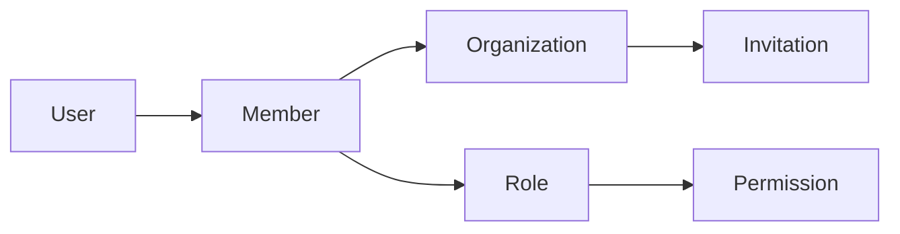
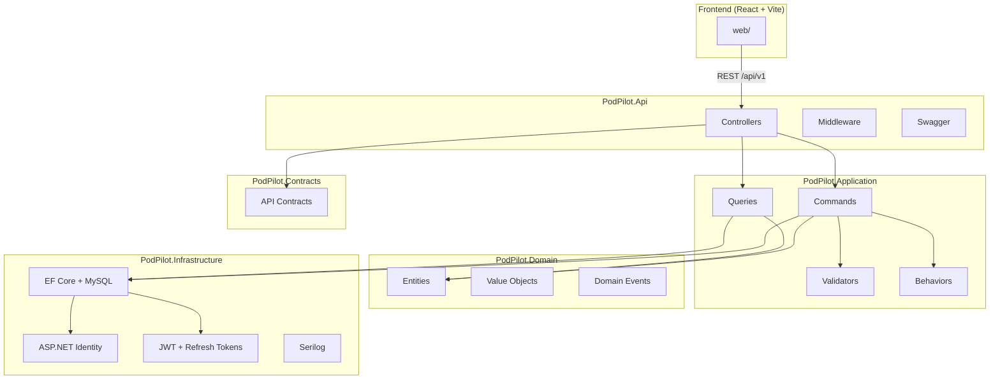
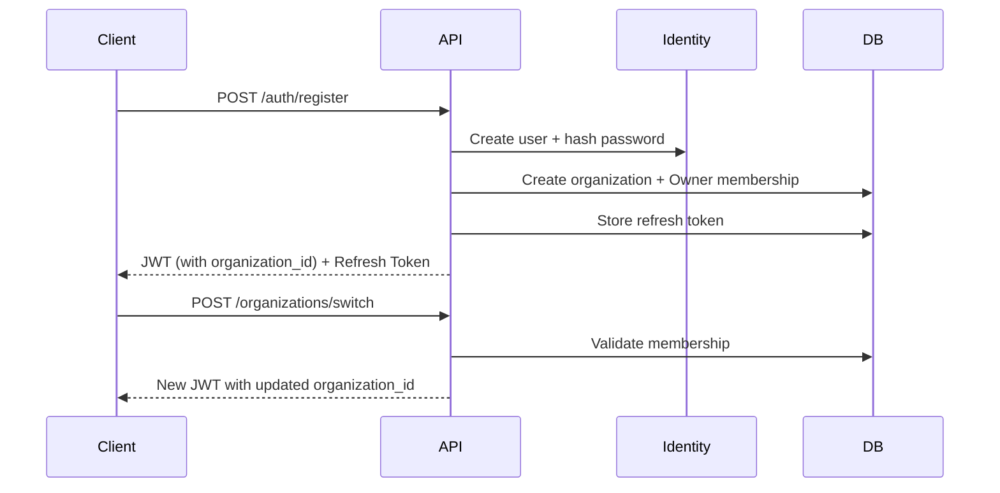

# PodPilot

**PodPilot** is an AI Infrastructure Autopilot that automatically manages GPU pods, AI models, and inference providers. This repository contains **Part 1** (authentication foundation) and **Part 2** (multi-tenant organization management).

---

## Part 2 — Multi-Tenant Organizations

Part 2 transforms PodPilot into a **multi-tenant SaaS**. Every user belongs to one or more organizations, and all future resources (Pods, Models, Providers, Sessions) will be scoped to an organization.

### Multi-Tenant Design



- **Organization** — tenant boundary with slug, owner, and default-org flag
- **OrganizationMember** — links users to organizations with a role and status
- **Invitation** — email-based onboarding with expiring tokens
- **Permission** — granular capabilities (e.g. `Organization.Read`, `Pod.Create`)
- **Role** — Owner, Admin, Developer, Viewer with seeded permission mappings

### Current Organization Context

Users may belong to multiple organizations. The **active organization** is persisted in JWT claims:

| Claim | Description |
|-------|-------------|
| `organization_id` | Currently selected organization |
| `organization_role` | User's role in that organization |

Switching organizations calls `POST /organizations/switch`, which re-issues JWT + refresh tokens with updated claims.

### Permission System

Permissions are defined in `PermissionNames` and mapped to roles via `RolePermissionMatrix`:

| Role | Capabilities |
|------|-------------|
| **Owner** | Full control — delete org, transfer ownership, manage all resources |
| **Admin** | Manage members, invitations, and settings (cannot delete org) |
| **Developer** | Create/manage pods, providers, models (cannot manage users) |
| **Viewer** | Read-only access to organization resources |

Authorization is enforced server-side in CQRS handlers via `IOrganizationAuthorizationService`. The React frontend mirrors the same matrix for UI gating.

### Security Rules

- Only **Owner** can delete an organization
- Default organization cannot be deleted
- Only **Admin/Owner** can send invitations
- Only **Owner** can assign the Owner role (ownership transfer)
- **Developer** cannot manage users
- **Viewer** is read-only
- Cannot remove or demote the last Owner

---

## Architecture

PodPilot follows **Clean Architecture** with **CQRS** (MediatR) separating concerns across layers:



### Layer Responsibilities

| Layer | Responsibility |
|-------|----------------|
| **Domain** | Business entities, enums, value objects, domain events. No framework dependencies. |
| **Application** | CQRS handlers, FluentValidation, MediatR pipeline behaviors, service interfaces. |
| **Infrastructure** | EF Core persistence, Identity, JWT, Serilog, external service implementations. |
| **Contracts** | API request/response DTOs shared between API and clients. |
| **Api** | HTTP controllers, middleware, Swagger, DI composition root. |

### Authentication Flow



---

## Folder Structure

```
PodPilot/
├── src/
│   ├── PodPilot.Api/              # ASP.NET Core Web API
│   │   ├── Controllers/V1/        # Versioned API controllers
│   │   ├── Middleware/            # Exception, logging, correlation ID
│   │   └── Dockerfile
│   ├── PodPilot.Application/      # CQRS, validators, behaviors
│   ├── PodPilot.Domain/           # Entities, enums, value objects
│   ├── PodPilot.Infrastructure/   # EF Core, Identity, JWT, Serilog
│   └── PodPilot.Contracts/        # API DTOs
├── tests/
│   ├── PodPilot.Application.Tests/
│   └── PodPilot.Api.Tests/
├── web/                           # React + TypeScript + Vite
│   ├── src/
│   │   ├── components/
│   │   ├── pages/
│   │   ├── layouts/
│   │   ├── contexts/
│   │   ├── services/
│   │   ├── hooks/
│   │   ├── types/
│   │   └── utils/
│   └── Dockerfile
├── docker-compose.yml
├── Directory.Build.props
├── .editorconfig
├── stylecop.json
└── README.md
```

---

## Prerequisites

- [.NET 10 SDK](https://dotnet.microsoft.com/download)
- [Node.js 20.19+](https://nodejs.org/) (or 22.x)
- [Docker Desktop](https://www.docker.com/products/docker-desktop/) (for containerized deployment)
- MySQL 8.x running locally on port 3306

---

## Quick Start (Docker Compose)

The recommended way to run PodPilot:

```bash
docker compose up --build
```

| Service | URL |
|---------|-----|
| **Web UI** | http://localhost:3000 |
| **API** | http://localhost:5000 |
| **Swagger** | http://localhost:5000/swagger |
| **Health** | http://localhost:5000/api/v1/health |
| **MySQL** | localhost:3306 (local instance) |

Database migrations run automatically on API startup.

### Docker Services

- **api** — .NET 10 ASP.NET Core API (connects to host MySQL via `host.docker.internal`)
- **web** — React app served via nginx with API proxy

---

## Local Development

### 1. Ensure Local MySQL Is Running

Use your local MySQL instance on port **3306**. Create the database and user if needed:

```sql
CREATE DATABASE IF NOT EXISTS podpilot;
CREATE USER IF NOT EXISTS 'podpilot'@'localhost' IDENTIFIED BY 'podpilot_secret';
GRANT ALL PRIVILEGES ON podpilot.* TO 'podpilot'@'localhost';
FLUSH PRIVILEGES;
```

Update the connection string in `src/PodPilot.Api/appsettings.Development.json` if your credentials differ.

### 2. Run the API

```bash
cd src/PodPilot.Api
dotnet run
```

The API starts at http://localhost:5000 (or the port in `launchSettings.json`). Migrations apply automatically.

### 3. Run the Frontend

```bash
cd web
npm install
npm run dev
```

The frontend starts at http://localhost:5173 with API requests proxied to the backend.

---

## API Endpoints

All endpoints are versioned under `/api/v1/`:

| Method | Endpoint | Auth | Description |
|--------|----------|------|-------------|
| `POST` | `/auth/register` | No | Register user + organization |
| `POST` | `/auth/login` | No | Authenticate |
| `POST` | `/auth/refresh` | No | Rotate refresh token |
| `POST` | `/auth/logout` | Yes | Revoke refresh token |
| `GET` | `/users/me` | Yes | Current user profile |
| `GET` | `/health` | No | API + database health |

### Organizations (Part 2)

| Method | Endpoint | Description |
|--------|----------|-------------|
| `GET` | `/organizations` | List user's organizations |
| `GET` | `/organizations/{id}` | Get organization details |
| `POST` | `/organizations` | Create organization |
| `PUT` | `/organizations/{id}` | Update organization |
| `DELETE` | `/organizations/{id}` | Delete organization (Owner only) |
| `POST` | `/organizations/switch` | Switch current organization (re-issues tokens) |
| `GET` | `/organizations/{id}/members` | List members |
| `POST` | `/organizations/{id}/members` | Add existing user as member |
| `DELETE` | `/organizations/{id}/members/{memberId}` | Remove member |
| `PUT` | `/organizations/{id}/members/{memberId}/role` | Update member role |
| `POST` | `/organizations/{id}/invite` | Invite user by email |
| `POST` | `/organizations/accept` | Accept invitation by token |

### Example: Register

```bash
curl -X POST http://localhost:5000/api/v1/auth/register \
  -H "Content-Type: application/json" \
  -d '{
    "email": "admin@example.com",
    "password": "SecureP@ss1",
    "firstName": "Jane",
    "lastName": "Doe",
    "organizationName": "Acme AI"
  }'
```

---

## Database Schema

| Table | Description |
|-------|-------------|
| `Users` | ASP.NET Identity users (custom `ApplicationUser`) |
| `RefreshTokens` | JWT refresh tokens with rotation support |
| `Organizations` | Multi-tenant organization records |
| `OrganizationMembers` | User-organization memberships with roles |
| `Invitations` | Pending organization invitations |
| `Permissions` | Seeded permission definitions |
| `OrgRoles` | Seeded organization role catalog |
| `RolePermissions` | Role-to-permission mappings |
| `AuditLogs` | Immutable audit trail |
| `Roles` / `UserRoles` | ASP.NET Identity role management |

### Organization Roles

- **Owner** — Full control, can delete org and transfer ownership
- **Admin** — Manage members, invitations, and settings
- **Developer** — Manage workloads, read-only on user management
- **Viewer** — Read-only access

---

## Testing

```bash
# Run all tests
dotnet test

# Application unit tests (validators + permissions)
dotnet test tests/PodPilot.Application.Tests

# API integration tests (auth + organizations)
dotnet test tests/PodPilot.Api.Tests
```

## Frontend (Part 2)

| Page | Route | Description |
|------|-------|-------------|
| Organizations | `/organizations` | List and manage organizations |
| Create Organization | `/organizations/create` | Create new organization |
| Settings | `/organizations/:id/settings` | Edit/delete organization |
| Members | `/members` | Member table, invite, role management |
| Accept Invitation | `/invitations/accept?token=` | Accept email invitation |
| Profile | `/profile` | User profile and memberships |

Key components: `OrganizationSwitcher`, `OrganizationCard`, `MemberTable`, `InvitationModal`, `RoleBadge`, `Avatar`.

---

## Configuration

### JWT Settings (`appsettings.json`)

```json
{
  "Jwt": {
    "Issuer": "PodPilot",
    "Audience": "PodPilot",
    "Secret": "your-256-bit-secret-key-here",
    "AccessTokenExpirationMinutes": 15,
    "RefreshTokenExpirationDays": 7
  }
}
```

> **Important:** Change the JWT secret in production. Docker Compose uses environment variable overrides.

### Connection String

```
Server=localhost;Port=3306;Database=podpilot;User=podpilot;Password=podpilot_secret;
```

---

### JWT Settings (`appsettings.json`)

```json
{
  "Jwt": {
    "Issuer": "PodPilot",
    "Audience": "PodPilot",
    "Secret": "your-256-bit-secret-key-here",
    "AccessTokenExpirationMinutes": 15,
    "RefreshTokenExpirationDays": 7
  }
}
```

> **Important:** Change the JWT secret in production. Docker Compose uses environment variable overrides.

### Connection String

```
Server=localhost;Port=3306;Database=podpilot;User=podpilot;Password=podpilot_secret;
```

---

## Quality Standards

- **Nullable reference types** enabled solution-wide
- **Treat warnings as errors** enforced via `Directory.Build.props`
- **StyleCop Analyzers** for code style consistency
- **XML documentation** on public APIs (Swagger integration)
- **EditorConfig** for formatting conventions

---

## Logging

Serilog is configured with:

- **Console** output with structured properties
- **Rolling file** logs in `logs/podpilot-*.log` (30-day retention)
- **Request logging** via Serilog middleware
- **Correlation ID** propagated via `X-Correlation-Id` header

---

## What's Next (Part 3+)

Part 2 intentionally excludes:

- RunPod integration
- Ollama model management
- AI Gateway / inference providers
- GPU pod orchestration

These will be built on top of the multi-tenant organization layer.

---

## License

Copyright (c) PodPilot. All rights reserved.
