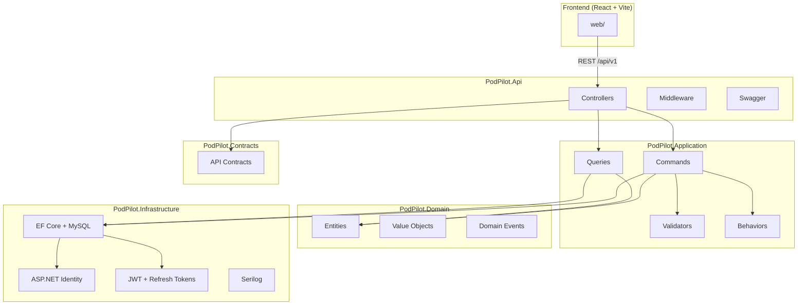
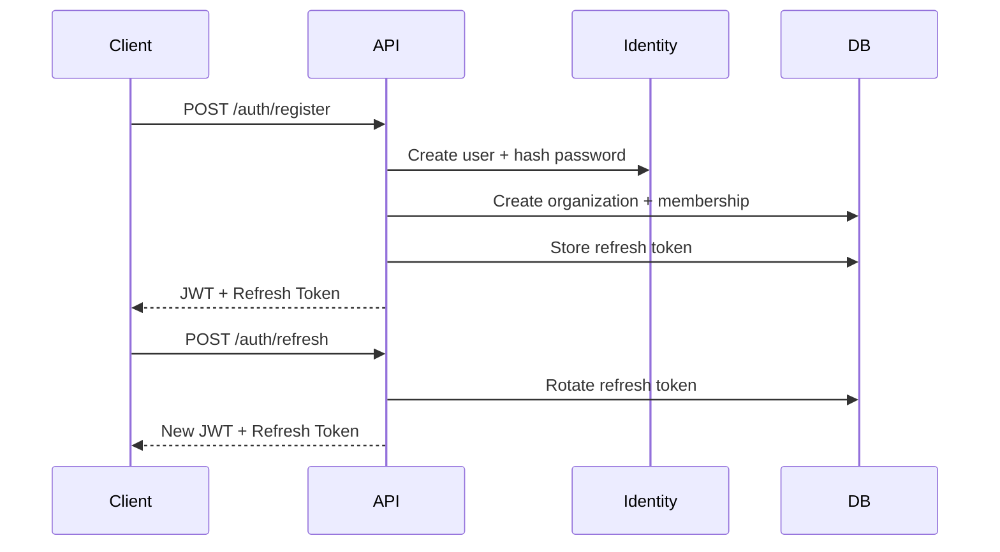

# PodPilot

**PodPilot** is an AI Infrastructure Autopilot that automatically manages GPU pods, AI models, and inference providers. This repository contains **Part 1** — the production-grade foundation for authentication, organizations, logging, health checks, and the React frontend shell.

---

## Architecture

PodPilot follows **Clean Architecture** with **CQRS** (MediatR) separating concerns across layers:



### Layer Responsibilities

| Layer | Responsibility |
|-------|----------------|
| **Domain** | Business entities, enums, value objects, domain events. No framework dependencies. |
| **Application** | CQRS handlers, FluentValidation, MediatR pipeline behaviors, service interfaces. |
| **Infrastructure** | EF Core persistence, Identity, JWT, Serilog, external service implementations. |
| **Contracts** | API request/response DTOs shared between API and clients. |
| **Api** | HTTP controllers, middleware, Swagger, DI composition root. |

### Authentication Flow



---

## Folder Structure

```
PodPilot/
├── src/
│   ├── PodPilot.Api/              # ASP.NET Core Web API
│   │   ├── Controllers/V1/        # Versioned API controllers
│   │   ├── Middleware/            # Exception, logging, correlation ID
│   │   └── Dockerfile
│   ├── PodPilot.Application/      # CQRS, validators, behaviors
│   ├── PodPilot.Domain/           # Entities, enums, value objects
│   ├── PodPilot.Infrastructure/   # EF Core, Identity, JWT, Serilog
│   └── PodPilot.Contracts/        # API DTOs
├── tests/
│   ├── PodPilot.Application.Tests/
│   └── PodPilot.Api.Tests/
├── web/                           # React + TypeScript + Vite
│   ├── src/
│   │   ├── components/
│   │   ├── pages/
│   │   ├── layouts/
│   │   ├── contexts/
│   │   ├── services/
│   │   ├── hooks/
│   │   ├── types/
│   │   └── utils/
│   └── Dockerfile
├── docker-compose.yml
├── Directory.Build.props
├── .editorconfig
├── stylecop.json
└── README.md
```

---

## Prerequisites

- [.NET 10 SDK](https://dotnet.microsoft.com/download)
- [Node.js 20.19+](https://nodejs.org/) (or 22.x)
- [Docker Desktop](https://www.docker.com/products/docker-desktop/) (for containerized deployment)
- MySQL 8.4 (if running locally without Docker)

---

## Quick Start (Docker Compose)

The recommended way to run PodPilot:

```bash
docker compose up --build
```

| Service | URL |
|---------|-----|
| **Web UI** | http://localhost:3000 |
| **API** | http://localhost:5000 |
| **Swagger** | http://localhost:5000/swagger |
| **Health** | http://localhost:5000/api/v1/health |
| **MySQL (Docker)** | localhost:3307 |

Database migrations run automatically on API startup.

### Docker Services

- **mysql** — MySQL 8.4 with persistent volume
- **api** — .NET 10 ASP.NET Core API
- **web** — React app served via nginx with API proxy

---

## Local Development

### 1. Start MySQL

```bash
docker compose up mysql -d
```

Or use your own MySQL instance and update the connection string in `src/PodPilot.Api/appsettings.Development.json`.

### 2. Run the API

```bash
cd src/PodPilot.Api
dotnet run
```

The API starts at http://localhost:5000 (or the port in `launchSettings.json`). Migrations apply automatically.

### 3. Run the Frontend

```bash
cd web
npm install
npm run dev
```

The frontend starts at http://localhost:5173 with API requests proxied to the backend.

---

## API Endpoints

All endpoints are versioned under `/api/v1/`:

| Method | Endpoint | Auth | Description |
|--------|----------|------|-------------|
| `POST` | `/auth/register` | No | Register user + organization |
| `POST` | `/auth/login` | No | Authenticate |
| `POST` | `/auth/refresh` | No | Rotate refresh token |
| `POST` | `/auth/logout` | Yes | Revoke refresh token |
| `GET` | `/users/me` | Yes | Current user profile |
| `GET` | `/health` | No | API + database health |

### Example: Register

```bash
curl -X POST http://localhost:5000/api/v1/auth/register \
  -H "Content-Type: application/json" \
  -d '{
    "email": "admin@example.com",
    "password": "SecureP@ss1",
    "firstName": "Jane",
    "lastName": "Doe",
    "organizationName": "Acme AI"
  }'
```

---

## Database Schema

| Table | Description |
|-------|-------------|
| `Users` | ASP.NET Identity users (custom `ApplicationUser`) |
| `RefreshTokens` | JWT refresh tokens with rotation support |
| `Organizations` | Multi-tenant organization records |
| `OrganizationMembers` | User-organization memberships with roles |
| `AuditLogs` | Immutable audit trail |
| `Roles` / `UserRoles` | ASP.NET Identity role management |

### Roles

- **Admin** — Organization administrator (assigned on registration)
- **Member** — Standard organization member

---

## Testing

```bash
# Run all tests
dotnet test

# Application unit tests (validators)
dotnet test tests/PodPilot.Application.Tests

# API integration tests (auth + health)
dotnet test tests/PodPilot.Api.Tests
```

---

## Configuration

### JWT Settings (`appsettings.json`)

```json
{
  "Jwt": {
    "Issuer": "PodPilot",
    "Audience": "PodPilot",
    "Secret": "your-256-bit-secret-key-here",
    "AccessTokenExpirationMinutes": 15,
    "RefreshTokenExpirationDays": 7
  }
}
```

> **Important:** Change the JWT secret in production. Docker Compose uses environment variable overrides.

### Connection String

```
Server=localhost;Port=3307;Database=podpilot;User=podpilot;Password=podpilot_secret;
```

---

## Quality Standards

- **Nullable reference types** enabled solution-wide
- **Treat warnings as errors** enforced via `Directory.Build.props`
- **StyleCop Analyzers** for code style consistency
- **XML documentation** on public APIs (Swagger integration)
- **EditorConfig** for formatting conventions

---

## Logging

Serilog is configured with:

- **Console** output with structured properties
- **Rolling file** logs in `logs/podpilot-*.log` (30-day retention)
- **Request logging** via Serilog middleware
- **Correlation ID** propagated via `X-Correlation-Id` header

---

## What's Next (Part 2+)

This foundation intentionally excludes:

- RunPod integration
- Ollama model management
- AI Gateway / inference providers
- GPU pod orchestration

These will be built on top of this authentication, organization, and infrastructure layer.

---

## License

Copyright (c) PodPilot. All rights reserved.
