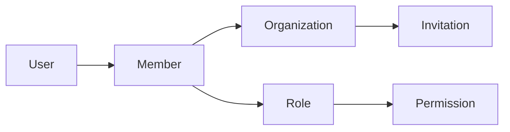
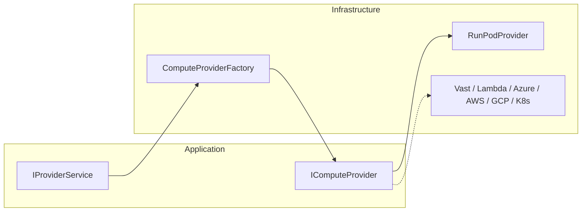
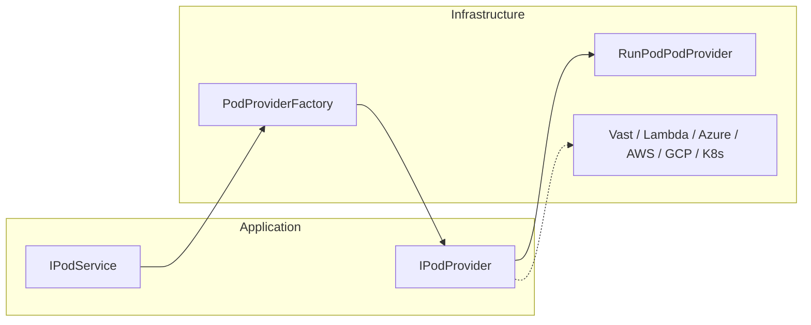
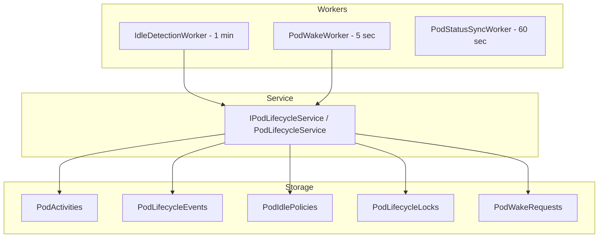
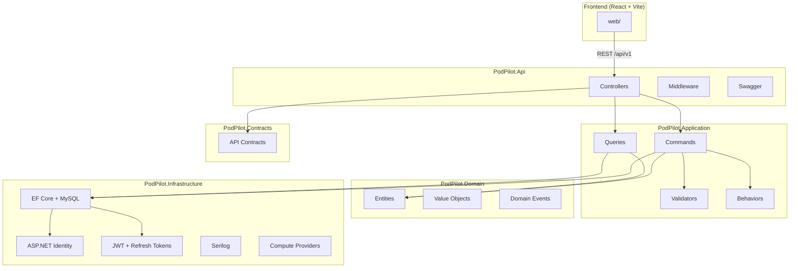
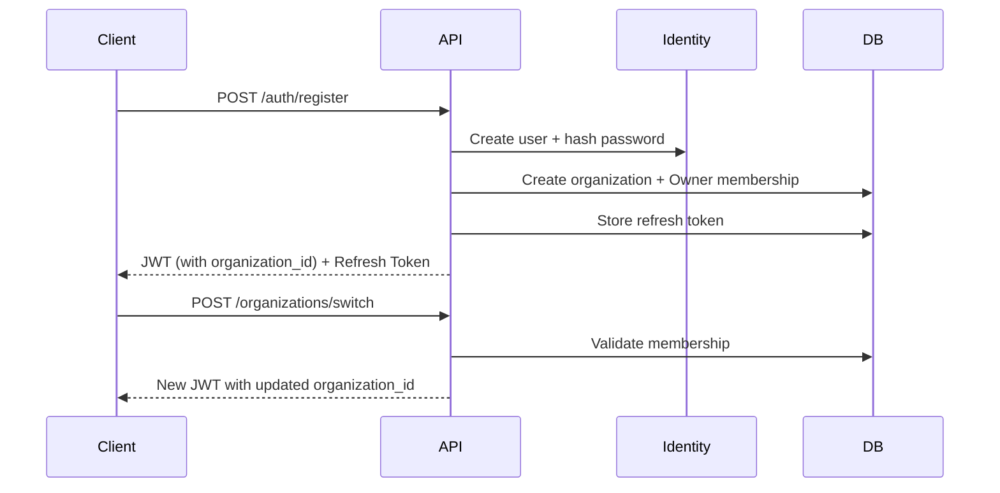

# PodPilot

**PodPilot** is an AI Infrastructure Autopilot that automatically manages GPU pods, AI models, and inference providers. This repository contains **Part 1** (authentication foundation), **Part 2** (multi-tenant organization management), **Part 3** (provider management abstraction), **Part 4** (GPU pod management), **Part 5** (automatic GPU lifecycle management), **Part 6** (AI Gateway), and **Part 7** (Ollama model management).

---

## Part 2 — Multi-Tenant Organizations

Part 2 transforms PodPilot into a **multi-tenant SaaS**. Every user belongs to one or more organizations, and all future resources (Pods, Models, Providers, Sessions) will be scoped to an organization.

### Multi-Tenant Design



- **Organization** — tenant boundary with slug, owner, and default-org flag
- **OrganizationMember** — links users to organizations with a role and status
- **Invitation** — email-based onboarding with expiring tokens
- **Permission** — granular capabilities (e.g. `Organization.Read`, `Pod.Create`)
- **Role** — Owner, Admin, Developer, Viewer with seeded permission mappings

### Current Organization Context

Users may belong to multiple organizations. The **active organization** is persisted in JWT claims:

| Claim | Description |
|-------|-------------|
| `organization_id` | Currently selected organization |
| `organization_role` | User's role in that organization |

Switching organizations calls `POST /organizations/switch`, which re-issues JWT + refresh tokens with updated claims.

### Permission System

Permissions are defined in `PermissionNames` and mapped to roles via `RolePermissionMatrix`:

| Role | Capabilities |
|------|-------------|
| **Owner** | Full control — delete org, transfer ownership, manage all resources |
| **Admin** | Manage members, invitations, and settings (cannot delete org) |
| **Developer** | Create/manage pods, providers, models (cannot manage users) |
| **Viewer** | Read-only access to organization resources |

Authorization is enforced server-side in CQRS handlers via `IOrganizationAuthorizationService`. The React frontend mirrors the same matrix for UI gating.

### Security Rules

- Only **Owner** can delete an organization
- Default organization cannot be deleted
- Only **Admin/Owner** can send invitations
- Only **Owner** can assign the Owner role (ownership transfer)
- **Developer** cannot manage users
- **Viewer** is read-only
- Cannot remove or demote the last Owner

---

## Part 3 — Provider Management

Part 3 introduces a **compute provider abstraction layer**. Organizations can connect external GPU infrastructure providers, validate credentials, inspect available regions/GPUs/templates, and monitor connection health — without coupling business logic to any single vendor API.

### Provider Abstraction



- **`IComputeProvider`** (Application interface) — vendor-neutral contract: validate credentials, list regions/GPUs/templates, account info, health checks
- **`ComputeProviderFactory`** (Infrastructure) — resolves the correct implementation by `ProviderType`
- **`RunPodProvider`** (Infrastructure) — first concrete implementation using RunPod GraphQL + REST APIs
- **Application layer never imports RunPod-specific code** — new providers are added by implementing `IComputeProvider` and registering in the factory

Supported provider types (enum): `RunPod`, `Vast`, `Lambda`, `Azure`, `AWS`, `GoogleCloud`, `Kubernetes`. Only **RunPod** is implemented in this phase; the enum and factory pattern allow future providers without changing CQRS handlers or controllers.

### Security

- API keys are encrypted at rest via ASP.NET Data Protection (`ProviderCredential`)
- API keys are **never** returned in API responses
- Key rotation is supported via `PUT /providers/{id}` with a new `apiKey`
- Validation and health checks decrypt credentials only in Infrastructure

### Background Health Monitoring

`ProviderHealthWorker` runs every **5 minutes**, checks each enabled provider, stores history in `ProviderHealthHistory`, and updates the current status on `ProviderHealth`.

### Provider Permissions

| Permission | Owner | Admin | Developer | Viewer |
|------------|-------|-------|-----------|--------|
| `Provider.Read` | ✓ | ✓ | ✓ | ✓ |
| `Provider.Create` | ✓ | ✓ | ✓ | |
| `Provider.Update` | ✓ | ✓ | ✓ | |
| `Provider.Delete` | ✓ | ✓ | | |

---

## Part 4 — GPU Pod Management

Part 4 adds full **GPU pod lifecycle management** on top of the provider abstraction. Users can create, view, start, stop, restart, delete, and sync pods — with RunPod as the first `IPodProvider` implementation.

### Pod Provider Abstraction



- **`IPodProvider`** — vendor-neutral pod lifecycle contract (create, start, stop, restart, delete, sync)
- **`RunPodPodProvider`** — RunPod REST API implementation (`https://rest.runpod.io/v1/pods`)
- **Application layer never calls RunPod directly** — handlers use `IPodService` only

### Pod Lifecycle

| Status | Description |
|--------|-------------|
| `Creating` | Pod provisioning in progress |
| `Starting` | Pod is starting |
| `Running` | Pod is active and billing |
| `Stopping` | Pod is shutting down |
| `Stopped` | Pod is stopped, volume data preserved |
| `Restarting` | Pod is restarting |
| `Deleting` | Pod termination in progress |
| `Deleted` | Pod removed (soft-deleted in DB) |
| `Failed` | Provisioning or operation failed |

### Real-Time Updates

`PodStatusHub` (SignalR at `/hubs/pods`) broadcasts `PodStatusChanged` events to organization groups whenever pod status changes — from user actions or the `PodStatusSyncWorker` (runs every 60 seconds).

### Pod Permissions

| Permission | Owner | Admin | Developer | Viewer |
|------------|-------|-------|-----------|--------|
| `Pod.Read` | ✓ | ✓ | ✓ | ✓ |
| `Pod.Create` | ✓ | ✓ | ✓ | |
| `Pod.Update` | ✓ | ✓ | ✓ | |
| `Pod.Delete` | ✓ | ✓ | ✓ | |

---

## Part 5 — Automatic GPU Lifecycle Management

Part 5 adds an intelligent **auto wake / auto shutdown engine** that tracks pod activity, detects idle GPUs, shuts down unused pods, and wakes stopped pods on demand.

### Lifecycle Engine



- **`IPodLifecycleService`** — wake, shutdown, activity tracking, idle evaluation, distributed locking
- **`IdleDetectionWorker`** — scans running pods every minute; queues shutdown when idle timeout + grace period elapse
- **`PodWakeWorker`** — processes queued wake requests; polls provider until pod is healthy
- **Database-backed locks** — `PodLifecycleLocks` prevent duplicate concurrent wake/shutdown operations

### Default Idle Policy

| Setting | Default |
|---------|---------|
| Idle timeout | 30 minutes |
| Grace period | 5 minutes |
| Minimum runtime | 10 minutes |
| Auto shutdown | Enabled |
| Auto wake | Enabled |

### SignalR Lifecycle Events

In addition to `PodStatusChanged`, the hub broadcasts: `PodStarted`, `PodStopped`, `PodSleeping`, `PodWaking`, `IdleDetected`, `WakeCompleted`, `ShutdownCompleted`, `PolicyUpdated`.

---

## Architecture

PodPilot follows **Clean Architecture** with **CQRS** (MediatR) separating concerns across layers:



### Layer Responsibilities

| Layer | Responsibility |
|-------|----------------|
| **Domain** | Business entities, enums, value objects, domain events. No framework dependencies. |
| **Application** | CQRS handlers, FluentValidation, MediatR pipeline behaviors, service interfaces. |
| **Infrastructure** | EF Core persistence, Identity, JWT, Serilog, external service implementations. |
| **Contracts** | API request/response DTOs shared between API and clients. |
| **Api** | HTTP controllers, middleware, Swagger, DI composition root. |

### Authentication Flow



---

## Folder Structure

```
PodPilot/
├── src/
│   ├── PodPilot.Api/              # ASP.NET Core Web API
│   │   ├── Controllers/V1/        # Versioned API controllers
│   │   ├── Middleware/            # Exception, logging, correlation ID
│   │   └── Dockerfile
│   ├── PodPilot.Application/      # CQRS, validators, behaviors
│   ├── PodPilot.Domain/           # Entities, enums, value objects
│   ├── PodPilot.Infrastructure/   # EF Core, Identity, JWT, Serilog
│   └── PodPilot.Contracts/        # API DTOs
├── tests/
│   ├── PodPilot.Application.Tests/
│   └── PodPilot.Api.Tests/
├── web/                           # React + TypeScript + Vite
│   ├── src/
│   │   ├── components/
│   │   ├── pages/
│   │   ├── layouts/
│   │   ├── contexts/
│   │   ├── services/
│   │   ├── hooks/
│   │   ├── types/
│   │   └── utils/
│   └── Dockerfile
├── docker-compose.yml
├── Directory.Build.props
├── .editorconfig
├── stylecop.json
└── README.md
```

---

## Prerequisites

- [.NET 10 SDK](https://dotnet.microsoft.com/download)
- [Node.js 20.19+](https://nodejs.org/) (or 22.x)
- [Docker Desktop](https://www.docker.com/products/docker-desktop/) (for containerized deployment)
- MySQL 8.x running locally on port 3306

---

## Quick Start (Docker Compose)

The recommended way to run PodPilot:

```bash
docker compose up --build
```

| Service | URL |
|---------|-----|
| **Web UI** | http://localhost:3000 |
| **API** | http://localhost:5000 |
| **Swagger** | http://localhost:5000/swagger |
| **Health** | http://localhost:5000/api/v1/health |
| **MySQL** | localhost:3306 (local instance) |

Database migrations and seeders run automatically:

1. **On every API build** (`dotnet build` on `PodPilot.Api`) — applies the latest migration via `--migrate-only`
2. **On Docker container start** — entrypoint runs migrations before the API starts
3. **On API startup** — idempotent check for any pending migrations

Applied migrations are recorded in both EF's `__EFMigrationsHistory` and the audit table `DatabaseMigrationHistory`. Each seeder run is appended to `DatabaseSeedHistory`.

To skip build-time migrations (CI without MySQL):

```bash
dotnet build -p:SkipDatabaseMigrations=true
dotnet test -p:SkipDatabaseMigrations=true
```

Manual migration only:

```bash
dotnet run --project src/PodPilot.Api -- --migrate-only
```

### Docker Services

- **api** — .NET 10 ASP.NET Core API (connects to host MySQL via `host.docker.internal`)
- **web** — React app served via nginx with API proxy

---

## Local Development

### 1. Ensure Local MySQL Is Running

Use your local MySQL instance on port **3306**. Create the database and user if needed:

```sql
CREATE DATABASE IF NOT EXISTS podpilot;
CREATE USER IF NOT EXISTS 'podpilot'@'localhost' IDENTIFIED BY 'podpilot_secret';
GRANT ALL PRIVILEGES ON podpilot.* TO 'podpilot'@'localhost';
FLUSH PRIVILEGES;
```

Update the connection string in `src/PodPilot.Api/appsettings.Development.json` if your credentials differ.

### 2. Run the API

```bash
cd src/PodPilot.Api
dotnet run
```

The API starts at http://localhost:5000 (or the port in `launchSettings.json`). Migrations apply automatically.

### 3. Run the Frontend

```bash
cd web
npm install
npm run dev
```

The frontend starts at http://localhost:5173 with API requests proxied to the backend.

---

## API Endpoints

All endpoints are versioned under `/api/v1/`:

| Method | Endpoint | Auth | Description |
|--------|----------|------|-------------|
| `POST` | `/auth/register` | No | Register user + organization |
| `POST` | `/auth/login` | No | Authenticate |
| `POST` | `/auth/refresh` | No | Rotate refresh token |
| `POST` | `/auth/logout` | Yes | Revoke refresh token |
| `GET` | `/users/me` | Yes | Current user profile |
| `GET` | `/health` | No | API + database health |

### Organizations (Part 2)

| Method | Endpoint | Description |
|--------|----------|-------------|
| `GET` | `/organizations` | List user's organizations |
| `GET` | `/organizations/{id}` | Get organization details |
| `POST` | `/organizations` | Create organization |
| `PUT` | `/organizations/{id}` | Update organization |
| `DELETE` | `/organizations/{id}` | Delete organization (Owner only) |
| `POST` | `/organizations/switch` | Switch current organization (re-issues tokens) |
| `GET` | `/organizations/{id}/members` | List members |
| `POST` | `/organizations/{id}/members` | Add existing user as member |
| `DELETE` | `/organizations/{id}/members/{memberId}` | Remove member |
| `PUT` | `/organizations/{id}/members/{memberId}/role` | Update member role |
| `POST` | `/organizations/{id}/invite` | Invite user by email |
| `POST` | `/organizations/accept` | Accept invitation by token |

### Providers (Part 3)

| Method | Endpoint | Description |
|--------|----------|-------------|
| `GET` | `/providers` | List organization providers |
| `GET` | `/providers/{id}` | Get provider details |
| `POST` | `/providers` | Create provider (validates credentials) |
| `PUT` | `/providers/{id}` | Update provider (supports API key rotation) |
| `DELETE` | `/providers/{id}` | Delete provider |
| `POST` | `/providers/validate` | Validate credentials before creation |
| `POST` | `/providers/{id}/validate` | Re-validate stored provider |
| `GET` | `/providers/{id}/regions` | List available regions |
| `GET` | `/providers/{id}/gpus` | List available GPU types |
| `GET` | `/providers/{id}/templates` | List deployment templates |
| `GET` | `/providers/{id}/health` | Current health + recent history |

### Pods (Part 4)

| Method | Endpoint | Description |
|--------|----------|-------------|
| `GET` | `/pods` | List organization pods |
| `GET` | `/pods/{id}` | Get pod details |
| `POST` | `/pods` | Create GPU pod |
| `PUT` | `/pods/{id}` | Update pod name/description |
| `DELETE` | `/pods/{id}` | Delete pod (`force` for running pods) |
| `POST` | `/pods/{id}/start` | Start pod |
| `POST` | `/pods/{id}/stop` | Stop pod |
| `POST` | `/pods/{id}/restart` | Restart pod |
| `POST` | `/pods/{id}/sync` | Sync status with provider |
| `GET` | `/pods/{id}/activity` | List pod activity history |
| `GET` | `/pods/{id}/lifecycle` | Lifecycle summary (running/idle time, next shutdown) |
| `GET` | `/pods/{id}/lifecycle/events` | Lifecycle event history |
| `POST` | `/pods/{id}/wake` | Queue wake for stopped pod |
| `POST` | `/pods/{id}/shutdown` | Shut down running pod |
| `PUT` | `/pods/{id}/idle-policy` | Update auto wake/shutdown policy |

### Example: Register

```bash
curl -X POST http://localhost:5000/api/v1/auth/register \
  -H "Content-Type: application/json" \
  -d '{
    "email": "admin@example.com",
    "password": "SecureP@ss1",
    "firstName": "Jane",
    "lastName": "Doe",
    "organizationName": "Acme AI"
  }'
```

---

## Database Schema

| Table | Description |
|-------|-------------|
| `Users` | ASP.NET Identity users (custom `ApplicationUser`) |
| `RefreshTokens` | JWT refresh tokens with rotation support |
| `Organizations` | Multi-tenant organization records |
| `OrganizationMembers` | User-organization memberships with roles |
| `Invitations` | Pending organization invitations |
| `Permissions` | Seeded permission definitions |
| `OrgRoles` | Seeded organization role catalog |
| `RolePermissions` | Role-to-permission mappings |
| `ComputeProviders` | Organization-scoped compute provider configs |
| `ProviderCredentials` | Encrypted API keys (never exposed via API) |
| `ProviderRegions` | Cached/synced region catalog per provider |
| `ProviderGpuTypes` | Cached/synced GPU catalog per provider |
| `ProviderHealthHistory` | Periodic health check history |
| `GpuPods` | Organization-scoped GPU pod records |
| `PodConfigurations` | Deployment configuration per pod |
| `PodEndpoints` | Exposed network endpoints |
| `PodStatusHistory` | Pod status change history |
| `PodActivities` | Activity records for idle detection |
| `PodLifecycleEvents` | Lifecycle engine audit events |
| `PodIdlePolicies` | Per-pod auto wake/shutdown settings |
| `PodLifecycleLocks` | Distributed operation locks |
| `PodWakeRequests` | Queued wake requests |
| `AuditLogs` | Immutable audit trail |
| `DatabaseMigrationHistory` | Audit log of applied EF migrations |
| `DatabaseSeedHistory` | Audit log of seeder executions |
| `Roles` / `UserRoles` | ASP.NET Identity role management |

### Organization Roles

- **Owner** — Full control, can delete org and transfer ownership
- **Admin** — Manage members, invitations, and settings
- **Developer** — Manage workloads, read-only on user management
- **Viewer** — Read-only access

---

## Testing

```bash
# Run all tests
dotnet test

# Application unit tests (validators + permissions)
dotnet test tests/PodPilot.Application.Tests

# API integration tests (auth + organizations + providers + pods + lifecycle)
dotnet test tests/PodPilot.Api.Tests
```

## Frontend (Part 2 + Part 3 + Part 4 + Part 5)

| Page | Route | Description |
|------|-------|-------------|
| Organizations | `/organizations` | List and manage organizations |
| Create Organization | `/organizations/create` | Create new organization |
| Settings | `/organizations/:id/settings` | Edit/delete organization |
| Members | `/members` | Member table, invite, role management |
| Accept Invitation | `/invitations/accept?token=` | Accept email invitation |
| Profile | `/profile` | User profile and memberships |
| Providers | `/providers` | List connected compute providers |
| Add Provider | `/providers/add` | Validate API key, then save |
| Edit Provider | `/providers/:id/edit` | Update provider settings / rotate key |
| Provider Details | `/providers/:id` | Regions, GPUs, templates, health status |
| GPU Pods | `/pods` | Dashboard of running/stopped pods |
| Create Pod | `/pods/create` | Configure and deploy a GPU pod |
| Pod Details | `/pods/:id` | Status, config, endpoints, history |

Key components: `OrganizationSwitcher`, `OrganizationCard`, `MemberTable`, `InvitationModal`, `RoleBadge`, `Avatar`.

---

## Configuration

### JWT Settings (`appsettings.json`)

```json
{
  "Jwt": {
    "Issuer": "PodPilot",
    "Audience": "PodPilot",
    "Secret": "your-256-bit-secret-key-here",
    "AccessTokenExpirationMinutes": 15,
    "RefreshTokenExpirationDays": 7
  }
}
```

> **Important:** Change the JWT secret in production. Docker Compose uses environment variable overrides.

### Connection String

```
Server=localhost;Port=3306;Database=podpilot;User=podpilot;Password=podpilot_secret;
```

---

### JWT Settings (`appsettings.json`)

```json
{
  "Jwt": {
    "Issuer": "PodPilot",
    "Audience": "PodPilot",
    "Secret": "your-256-bit-secret-key-here",
    "AccessTokenExpirationMinutes": 15,
    "RefreshTokenExpirationDays": 7
  }
}
```

> **Important:** Change the JWT secret in production. Docker Compose uses environment variable overrides.

### Connection String

```
Server=localhost;Port=3306;Database=podpilot;User=podpilot;Password=podpilot_secret;
```

---

## Quality Standards

- **Nullable reference types** enabled solution-wide
- **Treat warnings as errors** enforced via `Directory.Build.props`
- **StyleCop Analyzers** for code style consistency
- **XML documentation** on public APIs (Swagger integration)
- **EditorConfig** for formatting conventions

---

## Logging

Serilog is configured with:

- **Console** output with structured properties
- **Rolling file** logs in `logs/podpilot-*.log` (30-day retention)
- **Request logging** via Serilog middleware
- **Correlation ID** propagated via `X-Correlation-Id` header

---

## Part 6 — AI Gateway

Part 6 adds an OpenAI/Anthropic-compatible AI Gateway that proxies inference requests to Ollama on GPU pods.

### Architecture

```
AI IDE (OpenAI / Anthropic client)
        ↓ API key auth
   AiGatewayController (/v1/*)
        ↓
      IAiGateway
   ┌────┴────┬──────────────┬────────────────┐
   │         │              │                │
IGatewayRouter  IPodLifecycleService  IInferenceClient  IStreamingProxy
   │         │              │                │
   └────┬────┴──────────────┴────────────────┘
        ↓
   Ollama on GPU Pod
```

### Request Flow

1. Authenticate API key (`Authorization: Bearer sk-...` or `x-api-key`)
2. Resolve organization from key
3. Route request to pod via `IGatewayRouter` (model → route → pod)
4. Wake pod if stopped (`IPodLifecycleService`, source: `gateway`)
5. Poll Ollama health (`/api/tags`, `/api/version`)
6. Stream request/response via `IStreamingProxy` (transparent proxy)
7. Record `GatewayRequest`, `GatewayLatency`, and pod activity

### Supported Endpoints

| Endpoint | Compatibility |
|----------|---------------|
| `POST /v1/chat/completions` | OpenAI |
| `POST /v1/responses` | OpenAI |
| `GET /v1/models` | OpenAI / Anthropic |
| `POST /v1/messages` | Anthropic |

Management APIs (JWT): `/api/v1/gateway/*`

### API Keys

- Personal and organization-scoped keys
- SHA-256 hashed storage with prefix lookup
- Rotation and revocation
- Optional expiration
- Per-key and per-organization rate limits

### Streaming

- Server-sent events and chunked responses pass through unchanged
- Response headers applied before body streaming
- Cancellation and timeout supported

### Real-Time Dashboard

- SignalR hub: `/hubs/gateway`
- Events: `GatewayRequestStarted`, `GatewayRequestFinished`, `GatewayPodWake`, `GatewayError`
- Web UI: `/gateway`

### Example

```bash
# Create key (JWT)
curl -X POST http://localhost:5000/api/v1/gateway/api-keys \
  -H "Authorization: Bearer $JWT" \
  -H "Content-Type: application/json" \
  -d '{"name":"cursor","isPersonal":true}'

# Chat completion (API key)
curl http://localhost:5000/v1/chat/completions \
  -H "Authorization: Bearer sk-..." \
  -H "Content-Type: application/json" \
  -d '{"model":"llama3:latest","messages":[{"role":"user","content":"Hello"}]}'
```

---

## Part 7 — Ollama Model Management

Part 7 adds full **Ollama model lifecycle management** on GPU pods: detect Ollama, list/pull/delete models, track download progress, set defaults, and monitor health.

### Architecture

```
React Models UI
      ↓
/api/v1/models (JWT + RBAC)
      ↓
CQRS Handlers → IModelService
      ↓
IOllamaClient → Ollama on GPU Pod (:11434)
      ↓
AiModels / ModelDownloads / ModelHealthHistory (MySQL)
```

| Interface | Responsibility |
|-----------|----------------|
| `IOllamaClient` | Ollama HTTP API (tags, pull, show, delete, generate) |
| `IModelService` | Pod wake, pull orchestration, refresh, default model |
| `IModelRepository` | EF persistence for models/downloads/health |
| `IModelHealthService` | Generate test + health history |
| `IModelNotificationService` | SignalR download/health events |

### API Endpoints

| Method | Path | Permission |
|--------|------|------------|
| GET | `/api/v1/models` | `Model.Read` |
| GET | `/api/v1/models/dashboard` | `Model.Read` |
| GET | `/api/v1/models/{id}` | `Model.Read` |
| POST | `/api/v1/models/pull` | `Model.Pull` |
| DELETE | `/api/v1/models/{id}?forceDefault=` | `Model.Delete` |
| POST | `/api/v1/models/{id}/default` | `Model.Manage` |
| POST | `/api/v1/models/refresh` | `Model.Manage` |
| GET | `/api/v1/models/downloads` | `Model.Read` |
| GET | `/api/v1/models/health` | `Model.Read` |

### SignalR

Hub: `/hubs/models`

Events: `ModelDownloadStarted`, `ModelDownloadProgress`, `ModelDownloadCompleted`, `ModelDeleted`, `HealthUpdated`

### Background Worker

`ModelHealthWorker` runs every 5 minutes — checks Ollama reachability, model availability, and a generate test prompt. Results stored in `ModelHealthHistory`.

### Frontend

| Route | Page |
|-------|------|
| `/models` | Dashboard + installed models |
| `/models/pull` | Pull new model |
| `/models/downloads` | Active/historical downloads |
| `/models/:id` | Model metadata + health |

### Example

```bash
# Refresh models from Ollama on a pod
curl -X POST http://localhost:5000/api/v1/models/refresh \
  -H "Authorization: Bearer <jwt>" \
  -H "Content-Type: application/json" \
  -d '{"podId":"<pod-guid>"}'

# Pull a model
curl -X POST http://localhost:5000/api/v1/models/pull \
  -H "Authorization: Bearer <jwt>" \
  -H "Content-Type: application/json" \
  -d '{"podId":"<pod-guid>","model":"llama3:latest"}'
```

---

## What's Next (Part 8+)

Part 7 intentionally excludes:

- Billing
- Multi-provider routing
- Analytics
- Marketplace

---

## License

Copyright (c) PodPilot. All rights reserved.
